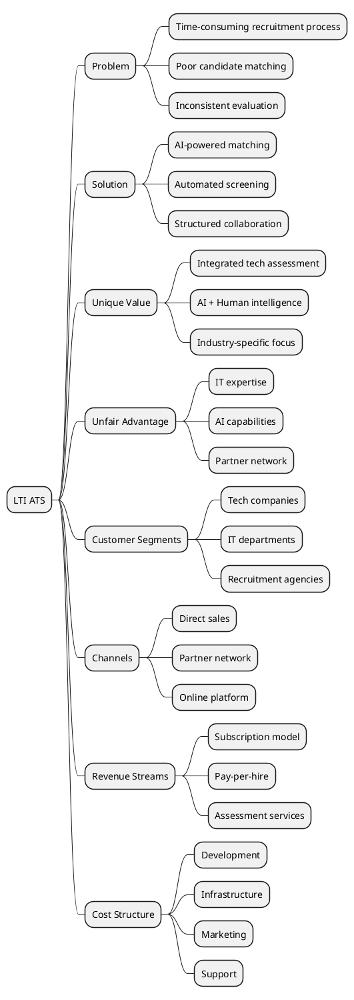
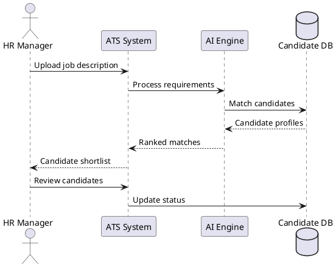
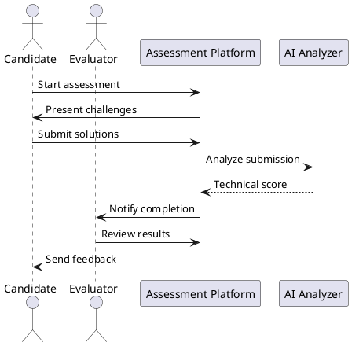
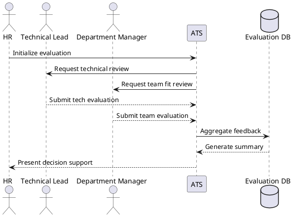
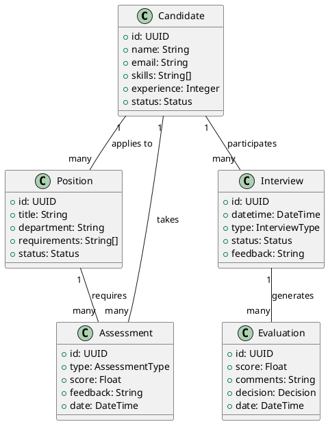
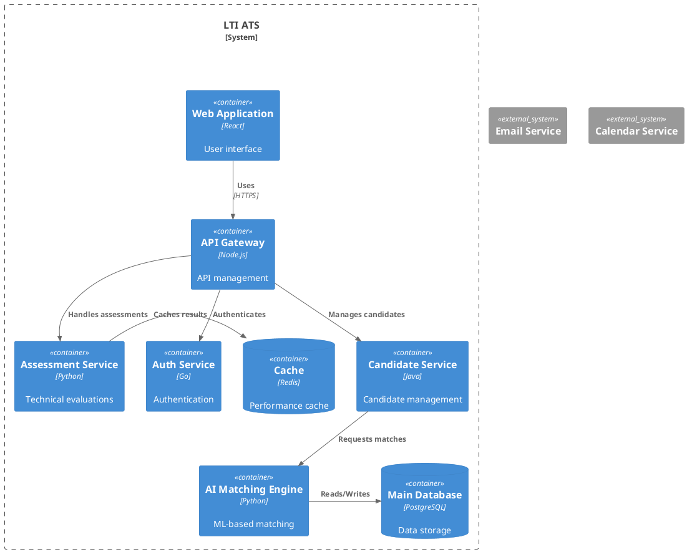
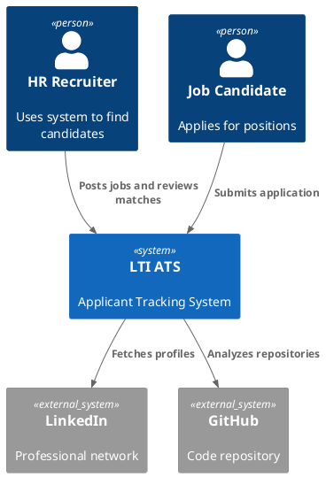
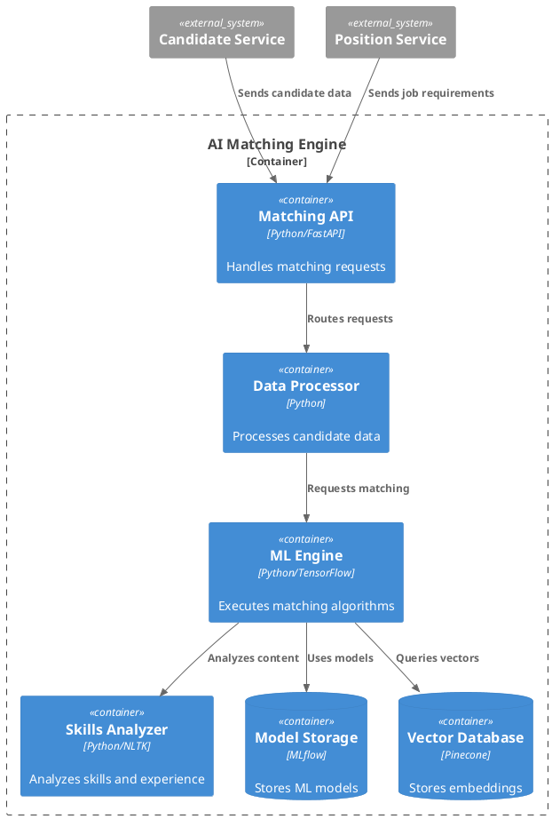
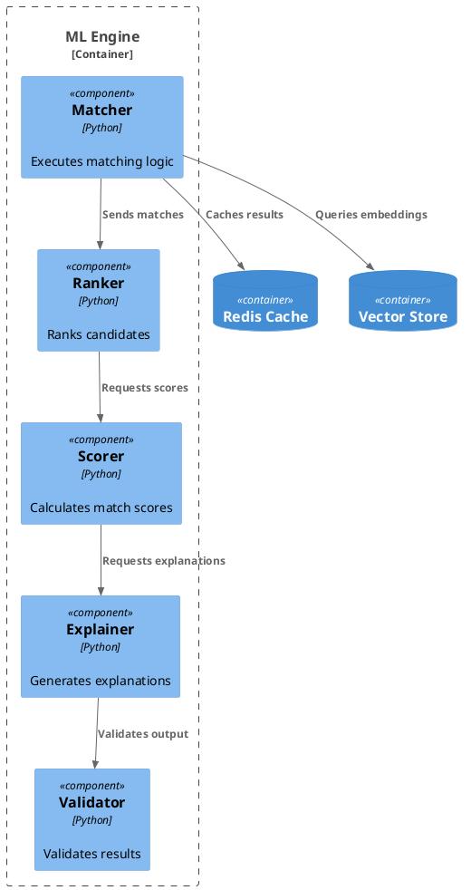

I'll help you create a comprehensive software architecture design for LTI's ATS (Applicant Tracking System). I'll provide the response in English as per the rules.

# LTI Applicant Tracking System - Architecture Design

## 1. Software Description

### Objective
LTI's ATS is an intelligent recruitment platform that streamlines the entire hiring process through AI-assisted automation. It optimizes HR efficiency by reducing time-to-hire, improving candidate matching, and providing data-driven insights for better hiring decisions.

### Competitive Advantages
1. **AI-Powered Skill Matching**: Advanced machine learning algorithms that match candidates to positions based on both hard and soft skills, with continuous learning capabilities.
2. **Integrated Assessment Platform**: Built-in technical assessment tools specifically designed for IT positions, including code evaluation and architecture design challenges.
3. **Collaborative Intelligence**: Unique approach combining AI recommendations with human expertise through structured collaboration workflows.

### Core Functions
- Intelligent candidate sourcing and matching
- Automated screening and initial assessment
- Collaborative evaluation workflows
- Interview scheduling and management
- Analytics and reporting dashboard
- Integration with major job boards and professional networks

### Lean Canvas


## 2. Key Use Cases

### Use Case 1: AI-Assisted Candidate Screening


### Use Case 2: Technical Assessment Flow


### Use Case 3: Collaborative Evaluation


## 3. Data Model

### Entities
1. **Candidate**
   - Core entity representing job applicants
   - Stores professional and contact information
   
2. **Position**
   - Represents job openings
   - Contains requirements and position details

3. **Assessment**
   - Technical and soft skills evaluations
   - Includes different types of assessments

4. **Interview**
   - Scheduling and feedback for interview sessions
   - Tracks multiple rounds of interviews

5. **Evaluation**
   - Collaborative feedback and scoring
   - Aggregates multiple evaluator inputs

### Entity Relationships


## 4. System Design (High Level)

### Global Description
The LTI ATS is designed as a microservices architecture to ensure scalability and maintainability. It uses event-driven communication for real-time updates and follows domain-driven design principles. The system is containerized using Docker and orchestrated with Kubernetes, enabling cloud-native deployment and scaling.

### System Architecture


## 5. C4 Detailed Diagram - AI Matching Engine

I'll focus on the AI Matching Engine as it's a critical component that differentiates LTI's ATS in the market.

### Component Justification
The AI Matching Engine is crucial because it:
- Reduces time-to-hire by automatically identifying suitable candidates
- Improves match quality through machine learning algorithms
- Provides data-driven insights for better hiring decisions
- Scales efficiently with increasing job positions and candidates

### Context Level


### Container Level


### Component Level


### Code Level (Optional)
```python:/Users/cristian/LIDR-AI4Devs/AI4Devs-design-1/src/matching/matcher.py
class SkillMatcher:
    def __init__(self, model_provider: ModelProvider, cache: Cache):
        self.model = model_provider.get_current_model()
        self.cache = cache
        self.validator = MatchValidator()
    
    async def find_matches(
        self, 
        position_id: str, 
        candidates: List[Candidate]
    ) -> List[Match]:
        # Get position requirements
        requirements = await self.get_position_requirements(position_id)
        
        # Generate embeddings
        requirement_vector = self.model.encode(requirements)
        
        # Find matches
        matches = []
        for candidate in candidates:
            score = await self.calculate_match_score(
                candidate, 
                requirement_vector
            )
            if self.validator.is_valid_match(score):
                matches.append(Match(candidate, score))
        
        return sorted(matches, key=lambda m: m.score, reverse=True)
```

This completes the detailed C4 model for the AI Matching Engine component, showing how it integrates with the rest of the system and handles the critical task of matching candidates to positions.

### Implementation Considerations
1. Security and Compliance
- Implement role-based access control (RBAC)
- Ensure GDPR compliance for candidate data
- Encrypt sensitive information at rest and in transit
- Implement audit logging for all critical operations
2. Performance Optimization
- Use caching strategies for frequently accessed data
- Implement database indexing for common queries
- Use message queues for asynchronous processing
- Configure auto-scaling policies for microservices
3. Integration Strategy
- REST APIs with OpenAPI specification
- Event-driven architecture for real-time updates
- Webhook support for external integrations
- OAuth2.0 for authentication
4. Monitoring and Observability
- Implement distributed tracing
- Set up metrics collection and dashboards
- Configure alerting for critical services
- Implement logging aggregation
### Development Roadmap
1. Phase 1: Core Features (3 months)
- Basic candidate management
- Job posting and application process
- Authentication and authorization
- Basic reporting
2. Phase 2: AI Integration (2 months)
- AI matching engine implementation
- Skills analysis system
- Initial ML model training
3. Phase 3: Advanced Features (3 months)
- Collaborative evaluation system
- Advanced analytics
- Integration with external platforms
- Mobile application
4. Phase 4: Enhancement (2 months)
- Performance optimization
- Advanced AI features
- Additional integrations
- Enhanced reporting
### Success Metrics
1. Technical Metrics
- System uptime: 99.9%
- API response time: < 200ms
- Matching accuracy: > 90%
- System scalability: 10,000+ concurrent users
2. Business Metrics
- Reduction in time-to-hire: 50%
- Increase in quality of hire: 30%
- User satisfaction: > 90%
- ROI for clients: 3x
This completes the comprehensive architecture design for LTI's ATS. The system is designed to be scalable, maintainable, and focused on delivering value through AI-powered recruitment automation while maintaining high security and performance standards.