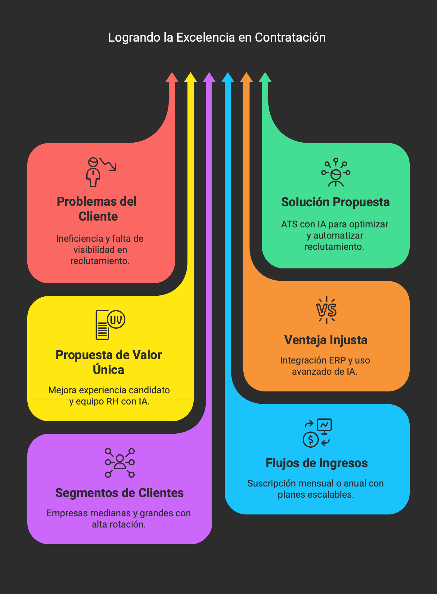
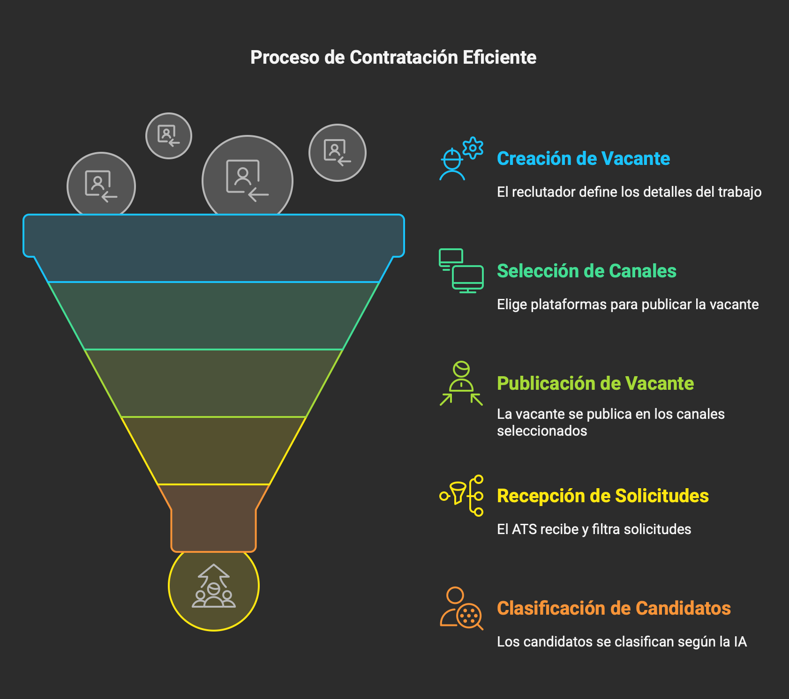
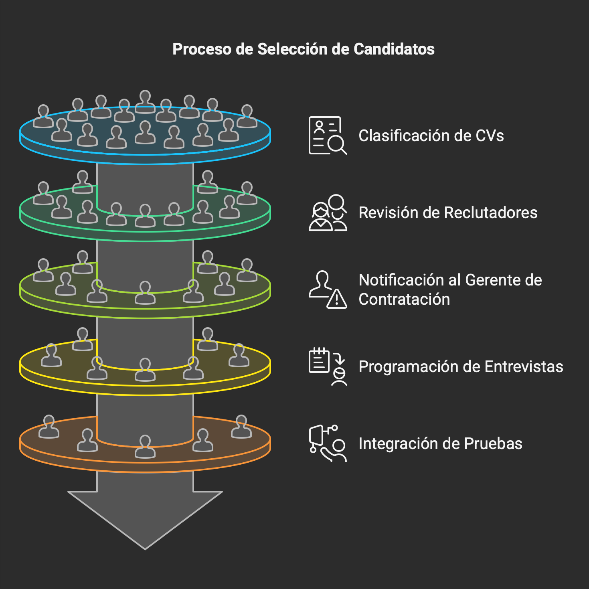
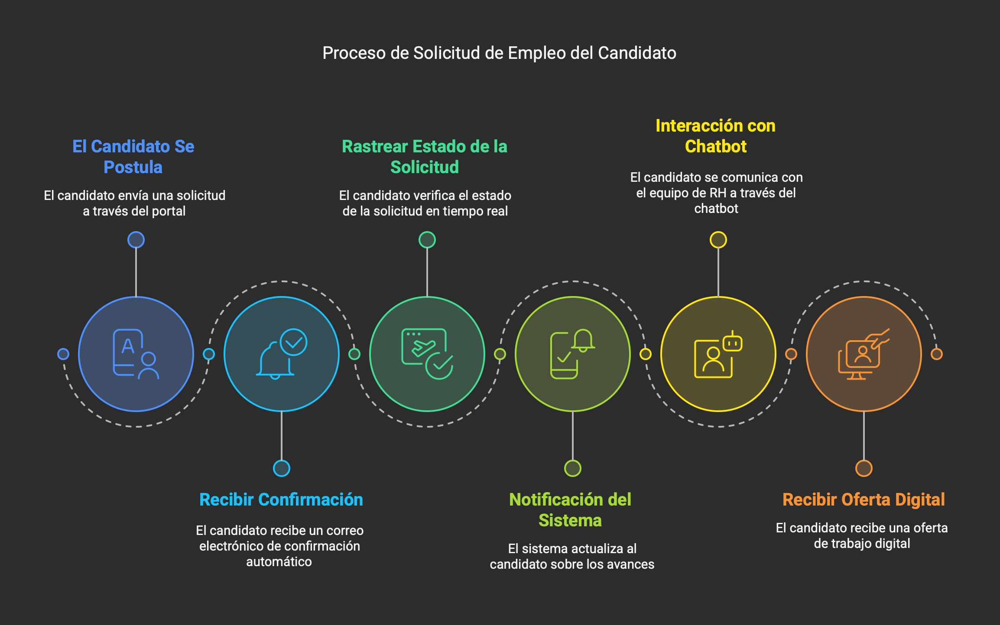
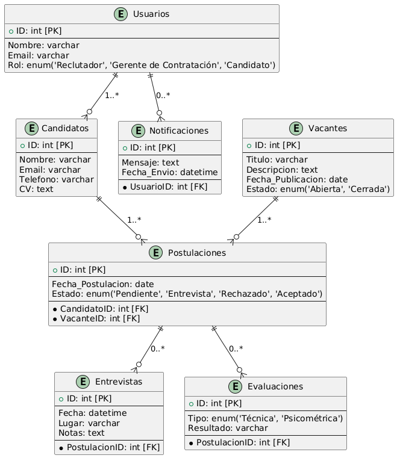
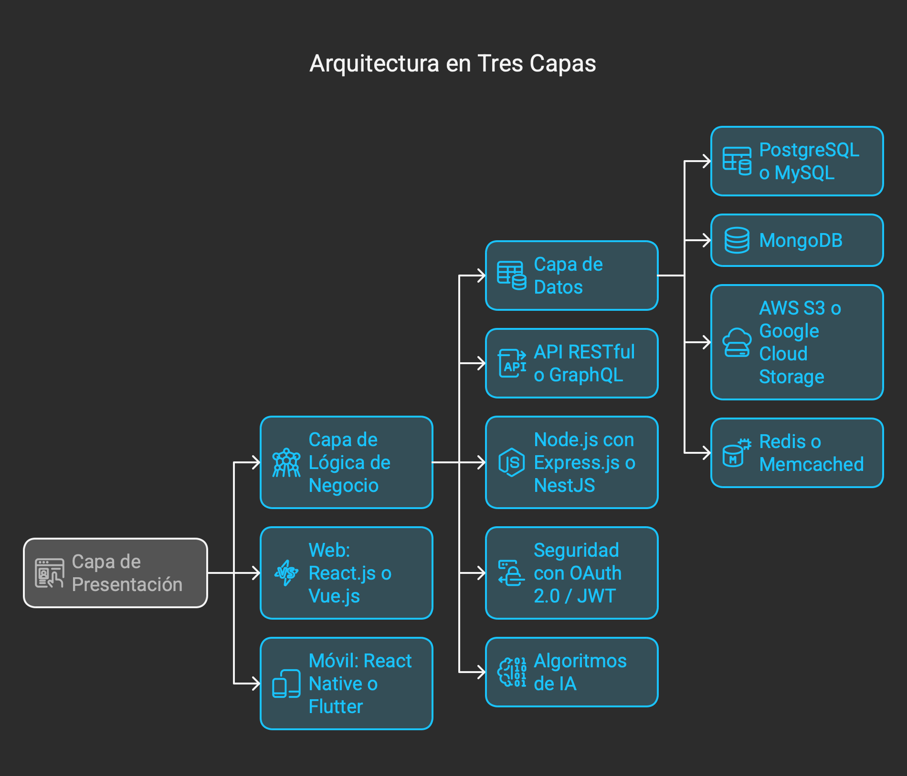
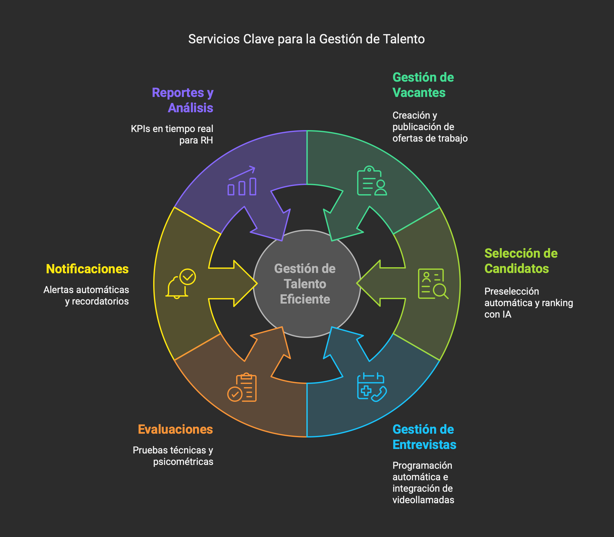
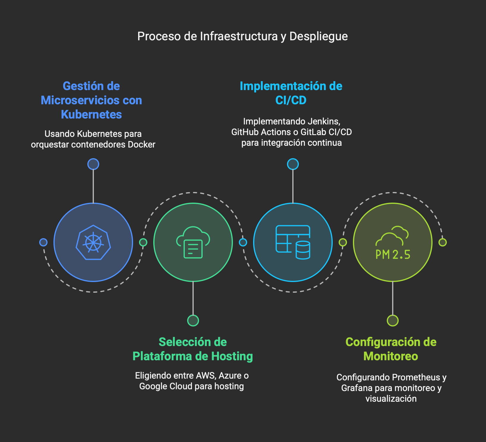

# **Resumen del Software ATS a Desarrollar**

El **ATS desarrollado para LTI** será un sistema de seguimiento de candidatos moderno, impulsado por **inteligencia artificial y automatización**, diseñado para **optimizar el proceso de reclutamiento**, **mejorar la colaboración** entre reclutadores y managers, y ofrecer **una experiencia excepcional a los candidatos**.

Este software permitirá a LTI **agilizar la contratación, reducir la carga administrativa del equipo de RH y mejorar la calidad de las contrataciones** mediante herramientas de automatización, IA y análisis de datos en tiempo real.

---

## **Puntos de Valor Añadido y Ventajas Competitivas**
1. **Automatización Completa**  
   - Reducción de carga operativa en procesos repetitivos.  
   - Programación automática de entrevistas y envíos de correos.  

2. **IA para Selección y Matching**  
   - Algoritmo de **machine learning** que compara perfiles con las vacantes.  
   - Eliminación de candidatos no adecuados y priorización de los más idóneos.  

3. **Experiencia del Candidato Mejorada**  
   - Portal de candidatos donde pueden **rastrear su proceso en tiempo real**.  
   - Chatbots con IA para resolver dudas y brindar información inmediata.  

4. **Analítica y Reportes Predictivos**  
   - Datos en tiempo real sobre desempeño del reclutamiento.  
   - Identificación de cuellos de botella en el proceso de selección.  

5. **Integración con Herramientas Externas**  
   - Conexión con LinkedIn, Indeed y otras plataformas de empleo.  
   - Sincronización con sistemas de nómina y ERP de LTI.  

6. **Evaluaciones Automatizadas**  
   - Pruebas técnicas y psicométricas integradas en la plataforma.  
   - Resultados inmediatos y comparaciones entre candidatos.  

---

## **Funciones Principales**
### 1️⃣ **Gestión de Vacantes**
   - Creación y publicación en múltiples plataformas.  
   - Página de empleo personalizada para LTI.  

### 2️⃣ **Recepción y Filtrado de Candidatos**
   - AI para selección automatizada basada en habilidades y experiencia.  
   - Organización de perfiles y eliminación de duplicados.  

### 3️⃣ **Automatización del Proceso de Selección**
   - Correos automáticos y agendado de entrevistas.  
   - Plantillas predefinidas de comunicación.  

### 4️⃣ **Evaluaciones Técnicas y Psicométricas**
   - Integración con plataformas de evaluación.  
   - Generación de reportes con resultados.  

### 5️⃣ **Entrevistas Virtuales y Video Screening**
   - Videollamadas dentro del ATS con grabación y análisis por IA.  
   - Entrevistas pregrabadas con respuestas estructuradas.  

### 6️⃣ **Colaboración en Tiempo Real**
   - Comentarios en perfiles de candidatos.  
   - Flujo de aprobaciones y notificaciones en tiempo real.  

### 7️⃣ **Análisis y Reportes**
   - KPIs clave: tiempo promedio de contratación, tasa de conversión, etc.  
   - Análisis de desempeño de reclutadores y fuentes de candidatos.  

---

# **Casos de Uso Principales del ATS para LTI**  

Aquí están los **tres casos de uso clave** para el **sistema de seguimiento de candidatos (ATS)** que se desarrollará, abordando a los principales usuarios del sistema: **el equipo de Recursos Humanos (RH), los gerentes de contratación y los candidatos**.

---

## **1️⃣ Caso de Uso: Publicación y Gestión de Vacantes**  
### **Actor Principal:** Reclutador de RH  
### **Objetivo:** Publicar ofertas de empleo en múltiples plataformas y gestionar postulaciones de manera eficiente.  

### **Flujo de Eventos:**  
1. **El reclutador inicia sesión** en el ATS.  
2. **Crea una nueva vacante**, definiendo el título, descripción, requisitos y salario.  
3. **Selecciona los canales de publicación** (LinkedIn, Indeed, página web corporativa, redes sociales, etc.).  
4. **Publica la vacante** y el sistema la distribuye automáticamente en los canales seleccionados.  
5. **El ATS comienza a recibir postulaciones** y las filtra con IA según la compatibilidad con la vacante.  
6. **El reclutador revisa el ranking de candidatos** y avanza con los más adecuados.  

### **Beneficio Clave:**  
✅ **Ahorro de tiempo** al publicar en múltiples plataformas desde un solo lugar y aplicar filtros inteligentes para preselección.  

---

## **2️⃣ Caso de Uso: Selección y Evaluación de Candidatos**  
### **Actor Principal:** Gerente de Contratación y Reclutador  
### **Objetivo:** Evaluar y seleccionar a los candidatos más adecuados de manera eficiente.  

### **Flujo de Eventos:**  
1. **El ATS analiza automáticamente los CVs** y genera un ranking basado en habilidades y experiencia.  
2. **Los reclutadores revisan los candidatos preseleccionados** y dejan comentarios dentro del sistema.  
3. **El gerente de contratación recibe notificaciones** y accede a la lista de candidatos recomendados.  
4. **Se programan entrevistas automáticamente** con los candidatos seleccionados.  
5. **El sistema integra pruebas técnicas y psicométricas**, enviando los resultados al panel de evaluación.  
6. **Tras la evaluación, el gerente de contratación aprueba o descarta candidatos** en el sistema.  

### **Beneficio Clave:**  
✅ **Optimización del proceso de selección** mediante **IA, automatización de entrevistas y evaluaciones**, reduciendo el tiempo de contratación.  

---

## **3️⃣ Caso de Uso: Seguimiento y Experiencia del Candidato**  
### **Actor Principal:** Candidato  
### **Objetivo:** Permitir a los candidatos rastrear el estado de su aplicación y recibir actualizaciones en tiempo real.  

### **Flujo de Eventos:**  
1. **El candidato se postula** a una vacante desde el portal del ATS.  
2. **Recibe una confirmación automática** con información sobre el proceso de selección.  
3. **Puede rastrear el estado de su aplicación** en tiempo real dentro del portal.  
4. **El sistema le notifica sobre avances** (por ejemplo, si ha sido preseleccionado o si se requiere una entrevista).  
5. **El candidato puede comunicarse con el equipo de RH** a través de un chatbot con IA para resolver dudas.  
6. **En caso de ser seleccionado, recibe una oferta digital** y puede firmar electrónicamente el contrato.  

### **Beneficio Clave:**  
✅ **Mejora la experiencia del candidato**, aumentando la transparencia del proceso y la tasa de aceptación de ofertas.  

---

## **Resumen de los Casos de Uso**  

| **#** | **Caso de Uso** | **Actor Principal** | **Beneficio Clave** |
|---|-------------------------------|----------------|------------------|
| 1️⃣ | **Publicación y Gestión de Vacantes** | Reclutador de RH | Publicación rápida en múltiples plataformas con IA para preselección. |
| 2️⃣ | **Selección y Evaluación de Candidatos** | Gerente de Contratación y Reclutador | IA y automatización para reducir tiempos de contratación. |
| 3️⃣ | **Seguimiento y Experiencia del Candidato** | Candidato | Transparencia y mejor experiencia con seguimiento en tiempo real. |

---

Estos casos de uso cubren las **funcionalidades principales del ATS**, enfocándose en la **eficiencia para RH, la automatización de la selección y la experiencia del candidato**. 🚀

---

# **Modelo entidad relación** 

---

# **Arquitectura Más Adecuada para el ATS de LTI**  

Para garantizar **escalabilidad, rendimiento y facilidad de mantenimiento**, la mejor arquitectura para este **Sistema de Seguimiento de Candidatos (ATS)** es una **arquitectura basada en microservicios** con una **API RESTful o GraphQL**.  

Se utilizará una **arquitectura de tres capas** con componentes desacoplados y tecnologías modernas para mejorar la experiencia del usuario y la eficiencia operativa.  

---

## **📌 Arquitectura de Alto Nivel**
La arquitectura óptima para este ATS sigue un **modelo basado en microservicios**, con una **estructura modular** distribuida en **tres capas principales**:  

### **1️⃣ Capa de Presentación (Frontend)**
Esta capa está enfocada en la **interacción del usuario** e incluye tanto la plataforma web como la aplicación móvil.  

🔹 **Tecnologías recomendadas:**  
   - **Web:** React.js o Vue.js con TypeScript  
   - **Móvil:** React Native o Flutter (para acceso desde dispositivos móviles)  
   - **Interfaz optimizada** para reclutadores, gerentes y candidatos  
   - **Accesibilidad y experiencia de usuario mejorada**  

---

### **2️⃣ Capa de Lógica de Negocio (Backend)**
Esta capa gestiona la **lógica del sistema, flujos de trabajo, seguridad y autenticación**.  

🔹 **Enfoque:** Microservicios desacoplados con API RESTful o GraphQL  
🔹 **Tecnologías recomendadas:**  
   - **Node.js con Express.js** o **NestJS** (para mayor modularidad)  
   - **Alternativa:** Laravel con PHP si el equipo de desarrollo tiene más experiencia en ese stack  
   - **Autenticación con OAuth 2.0 / JWT** para seguridad  
   - **Integración con IA para ranking y análisis de CVs**  
   - **Automatización de notificaciones y flujos de trabajo**  

---

### **3️⃣ Capa de Datos (Base de Datos y Almacenamiento)**
Esta capa almacena toda la información relacionada con el proceso de reclutamiento.  

🔹 **Base de Datos Relacional (SQL)**  
   - **PostgreSQL o MySQL** (estructura normalizada y relaciones entre entidades)  
   - **MongoDB (NoSQL)** para almacenar datos semi-estructurados como análisis de IA  

🔹 **Almacenamiento en la nube**  
   - **AWS S3 o Google Cloud Storage** para CVs, documentos y grabaciones de entrevistas  

🔹 **Caché y optimización**  
   - **Redis o Memcached** para mejorar tiempos de respuesta  

---

---

## **📌 Servicios Clave en la Arquitectura**
Para mantener la escalabilidad, cada módulo del sistema se separará en **microservicios independientes**, interconectados a través de la API.  

🔹 **Servicio de Gestión de Vacantes** – Creación, publicación y administración de ofertas de empleo.  
🔹 **Servicio de Selección de Candidatos** – Algoritmos de IA para preselección y ranking.  
🔹 **Servicio de Entrevistas** – Programación automática e integración con videollamadas (Zoom/Google Meet).  
🔹 **Servicio de Evaluaciones** – Pruebas técnicas y psicométricas integradas.  
🔹 **Servicio de Notificaciones** – Alertas automáticas y recordatorios por email/SMS.  
🔹 **Servicio de Reportes y Análisis** – KPIs y métricas en tiempo real para RH.  

---

---

## **📌 Infraestructura y Despliegue**
Para garantizar **alta disponibilidad y escalabilidad**, el ATS se desplegará en un entorno **en la nube con contenedores**.  

🔹 **Infraestructura recomendada:**  
   - **Kubernetes (K8s) con Docker** para la gestión de microservicios  
   - **AWS, Azure o Google Cloud** para hosting  
   - **CI/CD (Jenkins, GitHub Actions, GitLab CI/CD)** para despliegue automatizado  
   - **Logging y monitoreo con Prometheus + Grafana**  

---

---

## **📌 Beneficios de Esta Arquitectura**
✅ **Escalabilidad:** Microservicios desacoplados permiten escalar módulos según la demanda.  
✅ **Eficiencia:** La API centraliza la comunicación entre frontend y backend, optimizando recursos.  
✅ **Automatización:** IA y machine learning mejoran la eficiencia del reclutamiento.  
✅ **Seguridad:** Uso de OAuth 2.0/JWT y bases de datos seguras en la nube.  
✅ **Experiencia del usuario:** Interfaz optimizada y acceso móvil mejoran la interacción de candidatos y reclutadores.  

---

### **🚀 Resumen**
Esta arquitectura permite que el **ATS de LTI sea rápido, seguro y escalable**, asegurando un **flujo de trabajo eficiente** para RH y una **mejor experiencia para los candidatos**.  

