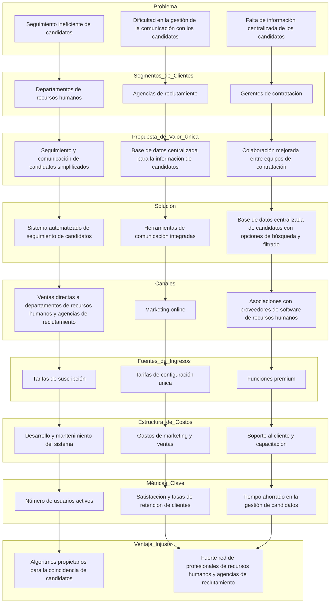
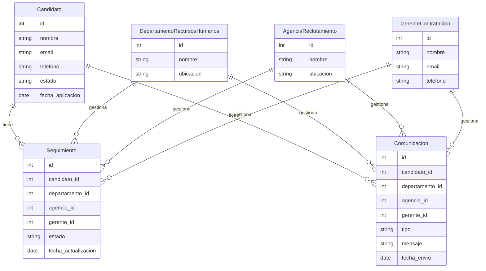
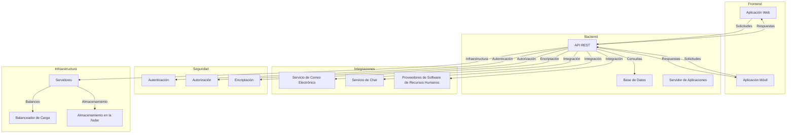
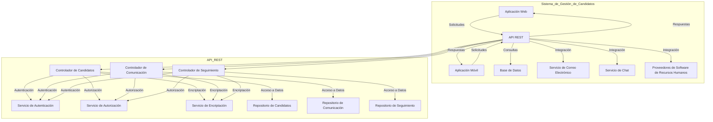

# Sistema de Gestión de Candidatos (SGC)

Un Sistema de Gestión de Candidatos (SGC) es una herramienta diseñada para ayudar a las empresas a gestionar el proceso de reclutamiento de manera más eficiente. Este sistema centraliza y organiza toda la información relacionada con los candidatos, desde la recepción de solicitudes hasta la contratación final. Facilita la comunicación, el seguimiento y la evaluación de los candidatos, mejorando la colaboración entre los equipos de recursos humanos y contratación.

## Funcionalidades Básicas de un Sistema de Gestión de Candidatos

### Seguimiento de Candidatos (ATS - Applicant Tracking System)

Permite gestionar y seguir el progreso de los candidatos a lo largo del proceso de selección.

### Base de Datos Centralizada

Almacena toda la información de los candidatos en un solo lugar, accesible para todos los miembros del equipo.

### Herramientas de Comunicación Integradas

Facilita la comunicación con los candidatos a través de correo electrónico, chat y otras plataformas.

### Publicación de Ofertas de Trabajo

Permite crear y publicar ofertas de trabajo en múltiples plataformas y portales de empleo.

### Filtros y Búsquedas Avanzadas

Ofrece opciones de búsqueda y filtrado para encontrar rápidamente candidatos que cumplan con ciertos criterios.

### Programación de Entrevistas

Ayuda a coordinar y programar entrevistas con los candidatos, integrándose con calendarios y herramientas de videoconferencia.

### Evaluación y Calificación de Candidatos

Proporciona herramientas para evaluar y calificar a los candidatos en función de sus habilidades y experiencia.

### Informes y Análisis

Genera informes y análisis sobre el proceso de reclutamiento, ayudando a identificar áreas de mejora.

### Integración con Otros Sistemas

Se integra con otros sistemas de recursos humanos y herramientas de gestión empresarial.

### Portal de Candidatos

Ofrece un portal donde los candidatos pueden registrarse, aplicar a ofertas y seguir el estado de sus solicitudes.

# Lean Canvas: Sistema de Gestión de Candidatos

## Problema
- Seguimiento ineficiente de candidatos
- Dificultad en la gestión de la comunicación con los candidatos
- Falta de información centralizada de los candidatos

## Segmentos de Clientes
- Departamentos de recursos humanos
- Agencias de reclutamiento
- Gerentes de contratación

## Propuesta de Valor Única
- Seguimiento y comunicación de candidatos simplificados
- Base de datos centralizada para la información de candidatos
- Colaboración mejorada entre equipos de contratación

## Solución
- Sistema automatizado de seguimiento de candidatos
- Herramientas de comunicación integradas (correo electrónico, chat)
- Base de datos centralizada de candidatos con opciones de búsqueda y filtrado

## Canales
- Ventas directas a departamentos de recursos humanos y agencias de reclutamiento
- Marketing online (sitio web, redes sociales)
- Asociaciones con proveedores de software de recursos humanos

## Fuentes de Ingresos
- Tarifas de suscripción
- Tarifas de configuración única
- Funciones premium (análisis avanzados, integraciones personalizadas)

## Estructura de Costos
- Desarrollo y mantenimiento del sistema
- Gastos de marketing y ventas
- Soporte al cliente y capacitación

## Métricas Clave
- Número de usuarios activos
- Satisfacción y tasas de retención de clientes
- Tiempo ahorrado en la gestión de candidatos

## Ventaja Injusta
- Algoritmos propietarios para la coincidencia de candidatos
- Fuerte red de profesionales de recursos humanos y agencias de reclutamiento

# Lean Canvas

# Casos de Uso

### Caso de Uso 1: Seguimiento de Candidatos
Descripción: Los departamentos de recursos humanos y agencias de reclutamiento necesitan una manera eficiente de seguir el progreso de los candidatos a lo largo del proceso de contratación. Asociación al Diagrama:

Problema: Seguimiento ineficiente de candidatos.
Segmentos de Clientes: Departamentos de recursos humanos, Agencias de reclutamiento.
Propuesta de Valor Única: Seguimiento y comunicación de candidatos simplificados.
Solución: Sistema automatizado de seguimiento de candidatos.
Canales: Ventas directas a departamentos de recursos humanos y agencias de reclutamiento.
Fuentes de Ingresos: Tarifas de suscripción.
Estructura de Costos: Desarrollo y mantenimiento del sistema.
Métricas Clave: Número de usuarios activos.
Ventaja Injusta: Algoritmos propietarios para la coincidencia de candidatos.

### Caso de Uso 2: Gestión de la Comunicación
Descripción: Los gerentes de contratación necesitan herramientas integradas para gestionar la comunicación con los candidatos de manera efectiva. Asociación al Diagrama:

Problema: Dificultad en la gestión de la comunicación con los candidatos.
Segmentos de Clientes: Gerentes de contratación.
Propuesta de Valor Única: Colaboración mejorada entre equipos de contratación.
Solución: Herramientas de comunicación integradas.
Canales: Marketing online.
Fuentes de Ingresos: Tarifas de configuración única.
Estructura de Costos: Gastos de marketing y ventas.
Métricas Clave: Satisfacción y tasas de retención de clientes.
Ventaja Injusta: Fuerte red de profesionales de recursos humanos y agencias de reclutamiento.

### Caso de Uso 3: Centralización de Información
Descripción: Las agencias de reclutamiento necesitan una base de datos centralizada para almacenar y acceder a la información de los candidatos de manera rápida y eficiente. Asociación al Diagrama:

Problema: Falta de información centralizada de los candidatos.
Segmentos de Clientes: Agencias de reclutamiento.
Propuesta de Valor Única: Base de datos centralizada para la información de candidatos.
Solución: Base de datos centralizada de candidatos con opciones de búsqueda y filtrado.
Canales: Asociaciones con proveedores de software de recursos humanos.
Fuentes de Ingresos: Funciones premium.
Estructura de Costos: Soporte al cliente y capacitación.
Métricas Clave: Tiempo ahorrado en la gestión de candidatos.
Ventaja Injusta: Algoritmos propietarios para la coincidencia de candidatos.

# Modelos de Datos

# Diagrama de arquitectura

# Diagrama C4

¡Claro! Vamos a crear un Diagrama C4 que profundice en el componente de API REST del sistema de gestión de candidatos. El Diagrama C4 se divide en cuatro niveles: Contexto, Contenedores, Componentes y Código. Aquí nos enfocaremos en los niveles de Contenedores y Componentes para la API REST.

## Diagrama C4 Completo

