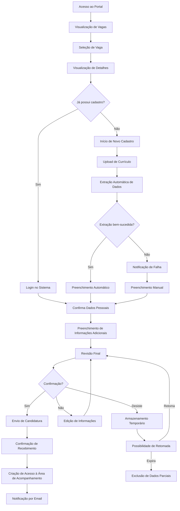
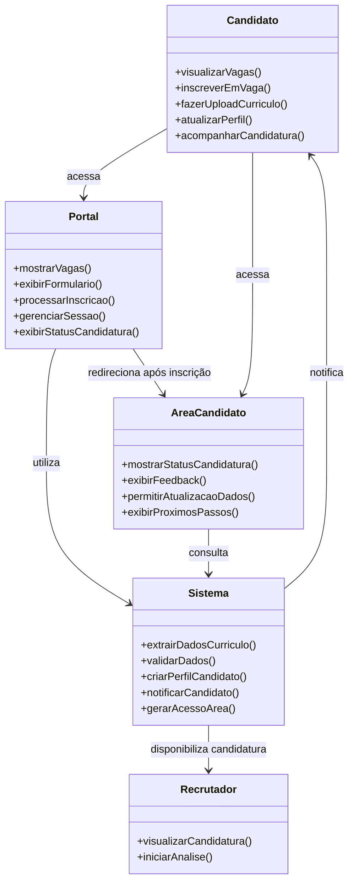
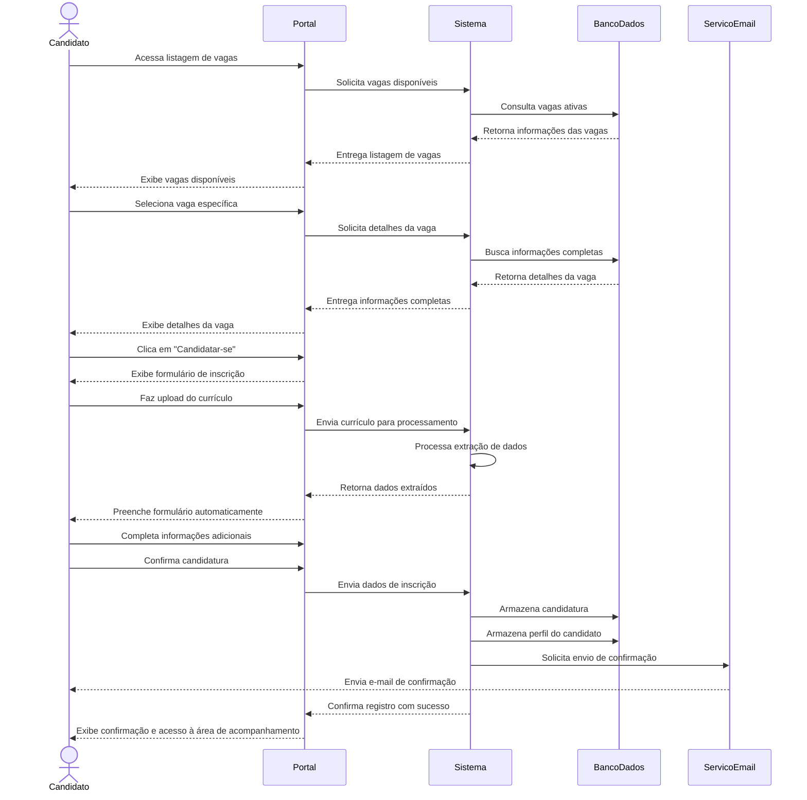
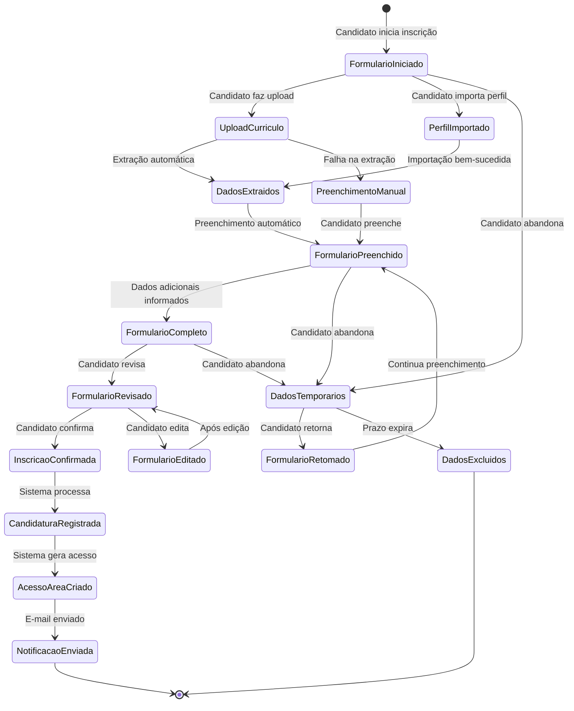

#
# LTI - Sistema Avançado de Gestão de Talentos

## Descrição Breve
LTI (Lean Talent Intelligence) é uma plataforma inovadora de Applicant Tracking System (ATS) projetada para otimizar e humanizar o processo de recrutamento e seleção. Desenvolvida com foco na experiência do recrutador e do candidato, a LTI utiliza inteligência artificial avançada para simplificar tarefas repetitivas, melhorar a qualidade das contratações e reduzir o tempo do ciclo de recrutamento.

## Valor Agregado
- **Inteligência Aplicada:** Algoritmos de IA que aprendem continuamente com cada processo seletivo, aperfeiçoando a correspondência entre candidatos e vagas.
- **Humanização Digital:** Experiência personalizada para candidatos com feedback contínuo e transparência em cada etapa do processo.
- **Visão Holística:** Avaliação de candidatos além do currículo, considerando soft skills, cultura organizacional e potencial de desenvolvimento.
- **Eficiência Operacional:** Automação inteligente que reduz em até 70% o tempo gasto em tarefas administrativas de recrutamento.

## Vantagens Competitivas
- **Análise Preditiva de Desempenho:** Previsão de adequação do candidato à função e cultura organizacional, reduzindo rotatividade.
- **Integração Omnichannel:** Presença unificada em redes sociais, plataformas de emprego e comunidades profissionais.
- **Jornada de Candidatura Responsiva:** Interface adaptável a qualquer dispositivo com tempos de resposta ultrarrápidos.
- **Escalabilidade Vertical:** Solução que atende desde startups até grandes corporações, com preços justos baseados no uso real.
- **Conformidade Global:** Adaptável automaticamente às legislações de proteção de dados (LGPD, GDPR) de diferentes países.

## Funções Principais

### Funções MVP (Produto Mínimo Viável)

#### 1. Portal de Candidatos
- Interface responsiva e intuitiva para inscrição em vagas
- Criação de perfil e upload de currículo com extração automatizada de dados
- Área do candidato para acompanhamento de status em tempo real
- Agendamento automático de entrevistas com sincronização de calendários
- Sistema de notificações personalizadas em cada etapa do processo

#### 2. Sourcing Inteligente
- Rastreamento proativo de talentos em diversas plataformas
- Construção automática de banco de talentos categorizado
- Recomendação de canais mais efetivos por tipo de vaga

#### 3. Triagem Cognitiva
- Análise semântica de currículos e compatibilidade com vagas
- Identificação de potencial além da experiência declarada
- Detecção de soft skills a partir de perfis profissionais

#### 4. Gestão de Pipeline
- Visualização personalizada do funil de recrutamento
- Acompanhamento em tempo real do status de cada candidato
- Automação de ações baseada em gatilhos e marcos do processo

#### 5. Comunicação Multicanal
- Chatbots integrados para dúvidas frequentes
- Agendamento automático de entrevistas com sincronização de calendários
- Notificações personalizadas em cada etapa do processo

#### 6. Avaliação 360°
- Testes técnicos e comportamentais integrados
- Coleta e consolidação de feedback de múltiplos entrevistadores
- Comparativo objetivo entre candidatos com base em critérios predefinidos

#### 7. Analytics & BI
- Dashboard de métricas de recrutamento em tempo real
- Relatórios customizáveis de performance e eficiência
- Insights para otimização contínua de processos seletivos

#### 8. Onboarding Contínuo
- Transição suave do processo seletivo para a integração
- Preparação antecipada de recursos para novos colaboradores
- Acompanhamento de adaptação nos primeiros 90 dias

# Lean Startup Canvas - Sistema LTI de Seguimiento de Candidatos

<!-- 
Este documento sigue fielmente el diseño y estructura del Lean Canvas original de Ash Maurya.
La numeración de los bloques sigue el orden sugerido para su cumplimentación.
-->

<table>
<tr>
  <td colspan="2" style="width:40%; border:1px solid #000; padding:10px; vertical-align:top;">
    <strong>1. PROBLEMA</strong> 
    <em>Top 3 problemas</em> 
    <ul>
      <li>Procesos de reclutamiento ineficientes y burocráticos que desperdician tiempo de RRHH</li>
      <li>Alta tasa de rotación por contrataciones inadecuadas</li>
      <li>Experiencia negativa e impersonal de los candidatos</li>
    </ul>
     
    <strong>ALTERNATIVAS EXISTENTES</strong> 
    <ul>
      <li>ATS tradicionales con interfaces complejas</li>
      <li>Hojas de cálculo y procesos manuales</li>
      <li>Tercerización completa del reclutamiento</li>
    </ul>
  </td>
  <td style="width:20%; border:1px solid #000; padding:10px; vertical-align:top;">
    <strong>2. SEGMENTOS DE CLIENTES</strong> 
    <em>Clientes objetivo</em> 
    <ul>
      <li>Empresas medianas en crecimiento</li>
      <li>Departamentos corporativos de RRHH</li>
      <li>Agencias de reclutamiento</li>
      <li>Startups tecnológicas</li>
      <li>Empresas con alta demanda estacional</li>
    </ul>
     
    <strong>EARLY ADOPTERS</strong> 
    <ul>
      <li>Startups tecnológicas en fase de rápida expansión</li>
      <li>Agencias de reclutamiento especializadas en perfiles técnicos</li>
    </ul>
  </td>
</tr>
<tr>
  <td style="width:20%; border:1px solid #000; padding:10px; vertical-align:top;">
    <strong>4. SOLUCIÓN</strong> 
    <em>Top 3 características</em> 
    <ul>
      <li>Sourcing Inteligente con IA que rastrea múltiples canales</li>
      <li>Clasificación Cognitiva que identifica habilidades más allá del currículum</li>
      <li>Pipeline visual personalizado con automatización de comunicación</li>
    </ul>
  </td>
  <td colspan="1" style="width:20%; border:1px solid #000; padding:10px; vertical-align:top;">
    <strong>3. PROPUESTA DE VALOR ÚNICA</strong> 
    <em>Mensaje claro y simple</em> 
    
Sistema ATS inteligente que reduce un 70% el tiempo en tareas administrativas y aumenta un 40% la calidad de las contrataciones mediante IA avanzada y humanización de procesos

     
    <strong>CONCEPTO DE ALTO NIVEL</strong> 
    
Reclutamiento humanizado potenciado por inteligencia artificial

  </td>
  <td style="width:20%; border:1px solid #000; padding:10px; vertical-align:top;">
    <strong>9. VENTAJA INJUSTA</strong> 
    <em>Difícil de copiar</em> 
    <ul>
      <li>Algoritmos propietarios de matching entrenados con datos exclusivos</li>
      <li>Experiencia de usuario desarrollada con metodología Jobs-to-be-Done</li>
      <li>Conformidad global automatizada con actualizaciones regulatorias en tiempo real</li>
    </ul>
  </td>
</tr>
<tr>
  <td colspan="2" style="width:40%; border:1px solid #000; padding:10px; vertical-align:top;">
    <strong>8. MÉTRICAS CLAVE</strong> 
    <em>Números que muestran el éxito</em> 
    <ul>
      <li>Tasa de conversión de pruebas a clientes pagados (meta: >20%)</li>
      <li>Tiempo medio del ciclo de reclutamiento (meta: reducción del 40%)</li>
      <li>NPS de candidatos (meta: >70)</li>
      <li>Tasa de retención mensual (meta: >95%)</li>
      <li>Tasa de éxito en contrataciones realizadas vía LTI (meta: >85% después de 6 meses)</li>
    </ul>
  </td>
  <td style="width:20%; border:1px solid #000; padding:10px; vertical-align:top;">
    <strong>5. CANALES</strong> 
    <em>Caminos hacia los clientes</em> 
    <ul>
      <li>Venta directa B2B</li>
      <li>Asociaciones con consultorías de RRHH</li>
      <li>Marketing de contenido especializado</li>
      <li>Programa de referidos</li>
      <li>Marketplaces de herramientas empresariales</li>
    </ul>
  </td>
</tr>
<tr>
  <td colspan="2" style="width:40%; border:1px solid #000; padding:10px; vertical-align:top;">
    <strong>7. ESTRUCTURA DE COSTOS</strong> 
    <em>Costos de operación</em> 
    
<strong>COSTOS FIJOS</strong>

    <ul>
      <li>Desarrollo y mantenimiento del software: 35%</li>
      <li>Infraestructura cloud y procesamiento de IA: 20%</li>
      <li>Equipo de soporte y customer success: 15%</li>
    </ul>
    
<strong>COSTOS VARIABLES</strong>

    <ul>
      <li>Marketing y adquisición de clientes: 20%</li>
      <li>Asociaciones e integraciones: 10%</li>
    </ul>
  </td>
  <td style="width:20%; border:1px solid #000; padding:10px; vertical-align:top;">
    <strong>6. FLUJOS DE INGRESOS</strong> 
    <em>Modelo de ingresos</em> 
    <ul>
      <li>Suscripción SaaS con niveles:
        <ul>
          <li>Basic: $1.500/mes</li>
          <li>Pro: $3.000/mes</li>
          <li>Enterprise: $5.000+/mes</li>
        </ul>
      </li>
      <li>Freemium para startups (hasta 10 vacantes)</li>
      <li>Add-ons específicos por industria</li>
      <li>Servicios de implementación y consultoría</li>
    </ul>
    
<strong>LTV Medio:</strong> $75.000

    
<strong>CAC Medio:</strong> $12.000

  </td>
</tr>
</table>

Lean Canvas es una adaptación del Business Model Canvas por Ash Maurya y está licenciado bajo CC BY-SA 3.0 
<strong>Versión:</strong> 1.0 | <strong>Fecha:</strong> 16/03/2025 | <strong>Actualizar en:</strong> 16/06/2025

# Casos de Uso Principales para MVP - Sistema LTI

Para un MVP de su sistema ATS LTI, recomendamos enfocarse en estos tres casos de uso principales:

## 1. Inscripción y Gestión de Candidatos (Portal de Candidatos)

* Permitir que los candidatos creen un perfil y se inscriban en vacantes
* Interfaz para cargar currículum con extracción automática de datos
* Área del candidato para seguimiento del estado de la candidatura
* Notificaciones básicas sobre actualizaciones en el proceso

## 2. Pipeline de Reclutamiento (Gestión de Pipeline + Comunicación)

* Visualización del embudo de reclutamiento para reclutadores
* Capacidad de mover candidatos entre etapas (nueva candidatura → filtrado → entrevista → etc.)
* Funcionalidad básica de comunicación con candidatos
* Programación de entrevistas y sistema de feedback interno

## 3. Filtrado Básico (elementos iniciales de la Clasificación Cognitiva)

* Filtros básicos por palabras clave y requisitos
* Correspondencia simplificada entre perfil y vacante
* Ordenación automática de candidatos por relevancia
* Marcación de candidatos para revisión posterior

---

Estos tres casos de uso forman un ciclo completo y funcional:

- **Entrada**: Candidatos ingresan al sistema
- **Proceso**: Reclutadores gestionan el flujo
- **Selección**: Filtrado y selección inicial de candidatos

Con estas funcionalidades, podrá entregar un producto funcional que ya resuelve dolores importantes de los usuarios, tanto reclutadores como candidatos, mientras establece la base para añadir recursos más avanzados de IA y análisis en las próximas iteraciones.

# Caso de Uso 1: Inscrição e Gestão de Candidatos

## Visão Geral

O módulo de Inscrição e Gestão de Candidatos é a porta de entrada do sistema LTI, permitindo que candidatos se inscrevam em vagas e acompanhem seu progresso no processo seletivo de forma transparente. Este componente é fundamental para criar uma experiência positiva desde o primeiro contato do candidato com a empresa.

## Objetivos

- Proporcionar uma experiência intuitiva e eficiente para candidatos se inscreverem em vagas
- Automatizar a extração de dados de currículos para reduzir o trabalho manual
- Fornecer transparência ao candidato sobre o status de sua candidatura
- Estabelecer um canal de comunicação consistente entre recrutadores e candidatos

## Atores Principais

- **Candidato**: Usuário que busca oportunidades de emprego e se inscreve nas vagas
- **Sistema**: Processos automatizados de extração de dados e notificações
- **Recrutador**: Usuário que revisa candidaturas (interface com Caso de Uso 2)

## Pré-Condições

- Vagas abertas já cadastradas no sistema
- Plataforma acessível via web e dispositivos móveis

## Fluxo Principal

1. Candidato acessa o portal de vagas da empresa
2. Candidato visualiza vagas disponíveis e seleciona uma de interesse
3. Sistema apresenta detalhes da vaga e botão de inscrição
4. Candidato clica em "Candidatar-se" e é direcionado para o formulário
5. Candidato faz upload de currículo ou autoriza importação de perfil (LinkedIn, etc.)
6. Sistema extrai automaticamente dados relevantes do currículo/perfil
7. Sistema preenche campos do formulário com dados extraídos
8. Candidato revisa, completa informações adicionais e confirma inscrição
9. Sistema confirma inscrição com sucesso e envia notificação por email
10. Candidato recebe acesso à área de acompanhamento de candidatura

## Diagrama de Fluxo do Processo

## Fluxos Alternativos

### A1: Candidato já possui cadastro no sistema
1. Sistema reconhece usuário e recupera informações já cadastradas
2. Candidato atualiza informações se necessário e confirma inscrição

### A2: Falha na extração de dados do currículo
1. Sistema notifica o candidato sobre a falha
2. Candidato preenche o formulário manualmente

### A3: Candidato desiste durante o processo de inscrição
1. Dados parciais são temporariamente armazenados
2. Candidato pode retornar e continuar de onde parou (por tempo limitado)

## Diagrama de Caso de Uso UML

## Diagrama de Sequência

## Diagrama de Estados da Candidatura

## Pós-Condições

- Candidatura registrada no sistema
- Perfil do candidato armazenado para futuras oportunidades
- Candidato com acesso à área de acompanhamento
- Candidatura disponível para análise no pipeline de recrutamento

## Requisitos Especiais

- Tempo de carregamento da página inferior a 3 segundos
- Extração de dados do currículo com precisão mínima de 85%
- Compatibilidade com os formatos mais comuns de currículo (PDF, DOCX, TXT)
- Conformidade com LGPD/GDPR para tratamento de dados pessoais

## Frequência de Uso

- Alta, processo contínuo durante períodos de recrutamento
- Picos esperados após publicação de novas vagas

## Métricas de Sucesso

- Taxa de conclusão do processo de inscrição > 80%
- Tempo médio de inscrição < 5 minutos
- Satisfação do candidato com o processo > 4/5
- Redução de 70% no tempo de processamento inicial de candidaturas

## Telas Principais

1. Listagem de Vagas
2. Detalhes da Vaga
3. Formulário de Inscrição
4. Confirmação de Inscrição
5. Área de Acompanhamento de Candidatura