# LTI - Sistema Avanzado de Gestión de Talentos

## Descripción Breve
LTI (Lean Talent Intelligence) es una plataforma innovadora de Applicant Tracking System (ATS) diseñada para optimizar y humanizar el proceso de reclutamiento y selección. Desarrollada con enfoque en la experiencia del reclutador y del candidato, LTI utiliza inteligencia artificial avanzada para simplificar tareas repetitivas, mejorar la calidad de las contrataciones y reducir el tiempo del ciclo de reclutamiento.

## Valor Agregado
- **Inteligencia Aplicada:** Algoritmos de IA que aprenden continuamente con cada proceso selectivo, perfeccionando la correspondencia entre candidatos y vacantes.
- **Humanización Digital:** Experiencia personalizada para candidatos con feedback continuo y transparencia en cada etapa del proceso.
- **Visión Holística:** Evaluación de candidatos más allá del currículum, considerando habilidades blandas, cultura organizacional y potencial de desarrollo.
- **Eficiencia Operacional:** Automatización inteligente que reduce hasta un 70% el tiempo dedicado a tareas administrativas de reclutamiento.

## Ventajas Competitivas
- **Análisis Predictivo de Desempeño:** Previsión de adecuación del candidato a la función y cultura organizacional, reduciendo la rotación.
- **Integración Omnicanal:** Presencia unificada en redes sociales, plataformas de empleo y comunidades profesionales.
- **Jornada de Candidatura Responsiva:** Interfaz adaptable a cualquier dispositivo con tiempos de respuesta ultrarrápidos.
- **Escalabilidad Vertical:** Solución que atiende desde startups hasta grandes corporaciones, con precios justos basados en el uso real.
- **Conformidad Global:** Adaptable automáticamente a las legislaciones de protección de datos (LGPD, GDPR) de diferentes países.

## Funciones Principales

### Funciones MVP (Producto Mínimo Viable)

#### 1. Portal de Candidatos
- Interfaz responsiva e intuitiva para inscripción en vacantes
- Creación de perfil y carga de currículum con extracción automatizada de datos
- Área del candidato para seguimiento de estatus en tiempo real
- Programación automática de entrevistas con sincronización de calendarios
- Sistema de notificaciones personalizadas en cada etapa del proceso

#### 2. Sourcing Inteligente
- Rastreo proactivo de talentos en diversas plataformas
- Construcción automática de banco de talentos categorizado
- Recomendación de canales más efectivos por tipo de vacante

#### 3. Clasificación Cognitiva
- Análisis semántico de currículos y compatibilidad con vacantes
- Identificación de potencial más allá de la experiencia declarada
- Detección de habilidades blandas a partir de perfiles profesionales

#### 4. Gestión de Pipeline
- Visualización personalizada del embudo de reclutamiento
- Seguimiento en tiempo real del estado de cada candidato
- Automatización de acciones basada en disparadores e hitos del proceso

#### 5. Comunicación Multicanal
- Chatbots integrados para dudas frecuentes
- Programación automática de entrevistas con sincronización de calendarios
- Notificaciones personalizadas en cada etapa del proceso

#### 6. Evaluación 360°
- Pruebas técnicas y comportamentales integradas
- Recopilación y consolidación de feedback de múltiples entrevistadores
- Comparativo objetivo entre candidatos con base en criterios predefinidos

#### 7. Analytics & BI
- Dashboard de métricas de reclutamiento en tiempo real
- Informes personalizables de rendimiento y eficiencia
- Insights para optimización continua de procesos selectivos

#### 8. Onboarding Continuo
- Transición suave del proceso selectivo a la integración
- Preparación anticipada de recursos para nuevos colaboradores
- Seguimiento de adaptación en los primeros 90 días

# Lean Startup Canvas - Sistema LTI de Seguimiento de Candidatos

<!-- 
Este documento sigue fielmente el diseño y estructura del Lean Canvas original de Ash Maurya.
La numeración de los bloques sigue el orden sugerido para su cumplimentación.
-->

<table>
<tr>
  <td colspan="2" style="width:40%; border:1px solid #000; padding:10px; vertical-align:top;">
    <strong>1. PROBLEMA</strong> 
    <em>Top 3 problemas</em> 
    <ul>
      <li>Procesos de reclutamiento ineficientes y burocráticos que desperdician tiempo de RRHH</li>
      <li>Alta tasa de rotación por contrataciones inadecuadas</li>
      <li>Experiencia negativa e impersonal de los candidatos</li>
    </ul>
     
    <strong>ALTERNATIVAS EXISTENTES</strong> 
    <ul>
      <li>ATS tradicionales con interfaces complejas</li>
      <li>Hojas de cálculo y procesos manuales</li>
      <li>Tercerización completa del reclutamiento</li>
    </ul>
  </td>
  <td style="width:20%; border:1px solid #000; padding:10px; vertical-align:top;">
    <strong>2. SEGMENTOS DE CLIENTES</strong> 
    <em>Clientes objetivo</em> 
    <ul>
      <li>Empresas medianas en crecimiento</li>
      <li>Departamentos corporativos de RRHH</li>
      <li>Agencias de reclutamiento</li>
      <li>Startups tecnológicas</li>
      <li>Empresas con alta demanda estacional</li>
    </ul>
     
    <strong>EARLY ADOPTERS</strong> 
    <ul>
      <li>Startups tecnológicas en fase de rápida expansión</li>
      <li>Agencias de reclutamiento especializadas en perfiles técnicos</li>
    </ul>
  </td>
</tr>
<tr>
  <td style="width:20%; border:1px solid #000; padding:10px; vertical-align:top;">
    <strong>4. SOLUCIÓN</strong> 
    <em>Top 3 características</em> 
    <ul>
      <li>Sourcing Inteligente con IA que rastrea múltiples canales</li>
      <li>Clasificación Cognitiva que identifica habilidades más allá del currículum</li>
      <li>Pipeline visual personalizado con automatización de comunicación</li>
    </ul>
  </td>
  <td colspan="1" style="width:20%; border:1px solid #000; padding:10px; vertical-align:top;">
    <strong>3. PROPUESTA DE VALOR ÚNICA</strong> 
    <em>Mensaje claro y simple</em> 
    
Sistema ATS inteligente que reduce un 70% el tiempo en tareas administrativas y aumenta un 40% la calidad de las contrataciones mediante IA avanzada y humanización de procesos

     
    <strong>CONCEPTO DE ALTO NIVEL</strong> 
    
Reclutamiento humanizado potenciado por inteligencia artificial

  </td>
  <td style="width:20%; border:1px solid #000; padding:10px; vertical-align:top;">
    <strong>9. VENTAJA INJUSTA</strong> 
    <em>Difícil de copiar</em> 
    <ul>
      <li>Algoritmos propietarios de matching entrenados con datos exclusivos</li>
      <li>Experiencia de usuario desarrollada con metodología Jobs-to-be-Done</li>
      <li>Conformidad global automatizada con actualizaciones regulatorias en tiempo real</li>
    </ul>
  </td>
</tr>
<tr>
  <td colspan="2" style="width:40%; border:1px solid #000; padding:10px; vertical-align:top;">
    <strong>8. MÉTRICAS CLAVE</strong> 
    <em>Números que muestran el éxito</em> 
    <ul>
      <li>Tasa de conversión de pruebas a clientes pagados (meta: >20%)</li>
      <li>Tiempo medio del ciclo de reclutamiento (meta: reducción del 40%)</li>
      <li>NPS de candidatos (meta: >70)</li>
      <li>Tasa de retención mensual (meta: >95%)</li>
      <li>Tasa de éxito en contrataciones realizadas vía LTI (meta: >85% después de 6 meses)</li>
    </ul>
  </td>
  <td style="width:20%; border:1px solid #000; padding:10px; vertical-align:top;">
    <strong>5. CANALES</strong> 
    <em>Caminos hacia los clientes</em> 
    <ul>
      <li>Venta directa B2B</li>
      <li>Asociaciones con consultorías de RRHH</li>
      <li>Marketing de contenido especializado</li>
      <li>Programa de referidos</li>
      <li>Marketplaces de herramientas empresariales</li>
    </ul>
  </td>
</tr>
<tr>
  <td colspan="2" style="width:40%; border:1px solid #000; padding:10px; vertical-align:top;">
    <strong>7. ESTRUCTURA DE COSTOS</strong> 
    <em>Costos de operación</em> 
    
<strong>COSTOS FIJOS</strong>

    <ul>
      <li>Desarrollo y mantenimiento del software: 35%</li>
      <li>Infraestructura cloud y procesamiento de IA: 20%</li>
      <li>Equipo de soporte y customer success: 15%</li>
    </ul>
    
<strong>COSTOS VARIABLES</strong>

    <ul>
      <li>Marketing y adquisición de clientes: 20%</li>
      <li>Asociaciones e integraciones: 10%</li>
    </ul>
  </td>
  <td style="width:20%; border:1px solid #000; padding:10px; vertical-align:top;">
    <strong>6. FLUJOS DE INGRESOS</strong> 
    <em>Modelo de ingresos</em> 
    <ul>
      <li>Suscripción SaaS con niveles:
        <ul>
          <li>Basic: $1.500/mes</li>
          <li>Pro: $3.000/mes</li>
          <li>Enterprise: $5.000+/mes</li>
        </ul>
      </li>
      <li>Freemium para startups (hasta 10 vacantes)</li>
      <li>Add-ons específicos por industria</li>
      <li>Servicios de implementación y consultoría</li>
    </ul>
    
<strong>LTV Medio:</strong> $75.000

    
<strong>CAC Medio:</strong> $12.000

  </td>
</tr>
</table>

Lean Canvas es una adaptación del Business Model Canvas por Ash Maurya y está licenciado bajo CC BY-SA 3.0 
<strong>Versión:</strong> 1.0 | <strong>Fecha:</strong> 16/03/2025 | <strong>Actualizar en:</strong> 16/06/2025

# Casos de Uso Principales para MVP - Sistema LTI

Para un MVP de su sistema ATS LTI, recomendamos enfocarse en estos tres casos de uso principales:

## 1. Inscripción y Gestión de Candidatos (Portal de Candidatos)

* Permitir que los candidatos creen un perfil y se inscriban en vacantes
* Interfaz para cargar currículum con extracción automática de datos
* Área del candidato para seguimiento del estado de la candidatura
* Notificaciones básicas sobre actualizaciones en el proceso

## 2. Pipeline de Reclutamiento (Gestión de Pipeline + Comunicación)

* Visualización del embudo de reclutamiento para reclutadores
* Capacidad de mover candidatos entre etapas (nueva candidatura → filtrado → entrevista → etc.)
* Funcionalidad básica de comunicación con candidatos
* Programación de entrevistas y sistema de feedback interno

## 3. Filtrado Básico (elementos iniciales de la Clasificación Cognitiva)

* Filtros básicos por palabras clave y requisitos
* Correspondencia simplificada entre perfil y vacante
* Ordenación automática de candidatos por relevancia
* Marcación de candidatos para revisión posterior

---

Estos tres casos de uso forman un ciclo completo y funcional:

- **Entrada**: Candidatos ingresan al sistema
- **Proceso**: Reclutadores gestionan el flujo
- **Selección**: Filtrado y selección inicial de candidatos

Con estas funcionalidades, podrá entregar un producto funcional que ya resuelve dolores importantes de los usuarios, tanto reclutadores como candidatos, mientras establece la base para añadir recursos más avanzados de IA y análisis en las próximas iteraciones.

# Caso de Uso 1: Inscripción y Gestión de Candidatos

## Visión General

El módulo de Inscripción y Gestión de Candidatos es la puerta de entrada del sistema LTI, permitiendo que los candidatos se inscriban en vacantes y acompañen su progreso en el proceso selectivo de forma transparente. Este componente es fundamental para crear una experiencia positiva desde el primer contacto del candidato con la empresa.

## Objetivos

- Proporcionar una experiencia intuitiva y eficiente para que los candidatos se inscriban en vacantes
- Automatizar la extracción de datos de currículums para reducir el trabajo manual
- Ofrecer transparencia al candidato sobre el estado de su candidatura
- Establecer un canal de comunicación consistente entre reclutadores y candidatos

## Actores Principales

- **Candidato**: Usuario que busca oportunidades de empleo y se inscribe en las vacantes
- **Sistema**: Procesos automatizados de extracción de datos y notificaciones
- **Reclutador**: Usuario que revisa candidaturas (interfaz con Caso de Uso 2)

## Pre-Condiciones

- Vacantes abiertas ya registradas en el sistema
- Plataforma accesible vía web y dispositivos móviles

## Flujo Principal

1. Candidato accede al portal de vacantes de la empresa
2. Candidato visualiza vacantes disponibles y selecciona una de interés
3. Sistema presenta detalles de la vacante y botón de inscripción
4. Candidato hace clic en "Postularse" y es dirigido al formulario
5. Candidato carga su currículum o autoriza importación de perfil (LinkedIn, etc.)
6. Sistema extrae automáticamente datos relevantes del currículum/perfil
7. Sistema rellena campos del formulario con datos extraídos
8. Candidato revisa, completa información adicional y confirma inscripción
9. Sistema confirma inscripción con éxito y envía notificación por email
10. Candidato recibe acceso al área de seguimiento de candidatura

## Diagrama de Flujo del Proceso

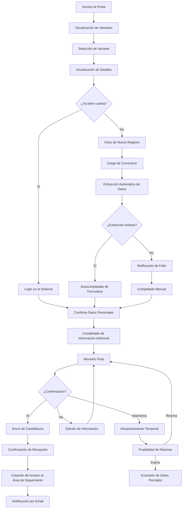

## Flujos Alternativos

### A1: Candidato ya posee cuenta en el sistema
1. Sistema reconoce usuario y recupera información ya registrada
2. Candidato actualiza información si es necesario y confirma inscripción

### A2: Fallo en la extracción de datos del currículum
1. Sistema notifica al candidato sobre el fallo
2. Candidato completa el formulario manualmente

### A3: Candidato desiste durante el proceso de inscripción
1. Datos parciales son temporalmente almacenados
2. Candidato puede retornar y continuar desde donde dejó (por tiempo limitado)

## Diagrama de Caso de Uso UML

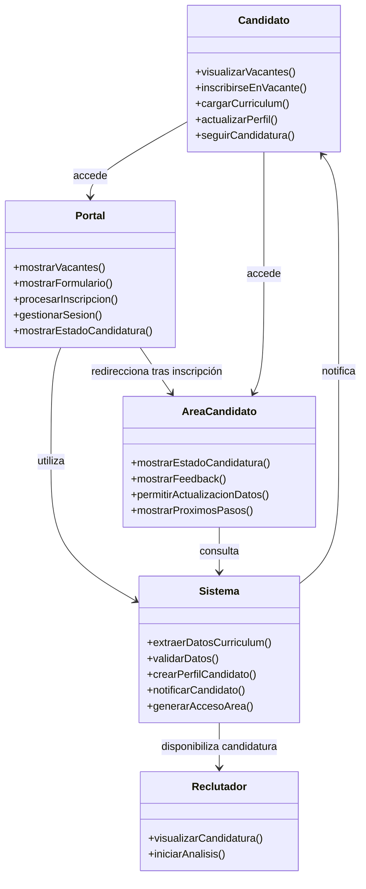

## Diagrama de Secuencia

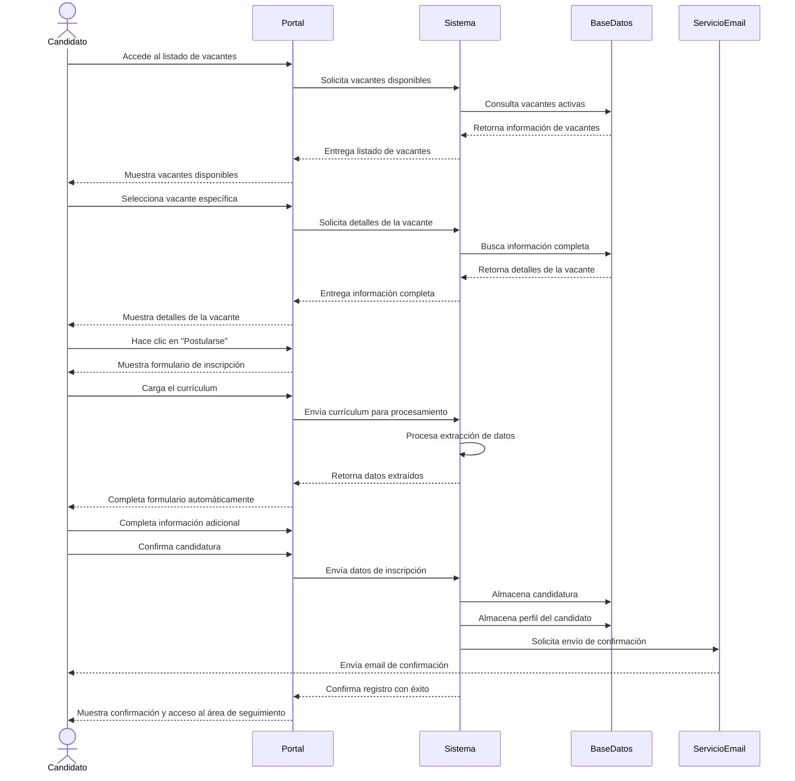

## Diagrama de Estados de la Candidatura

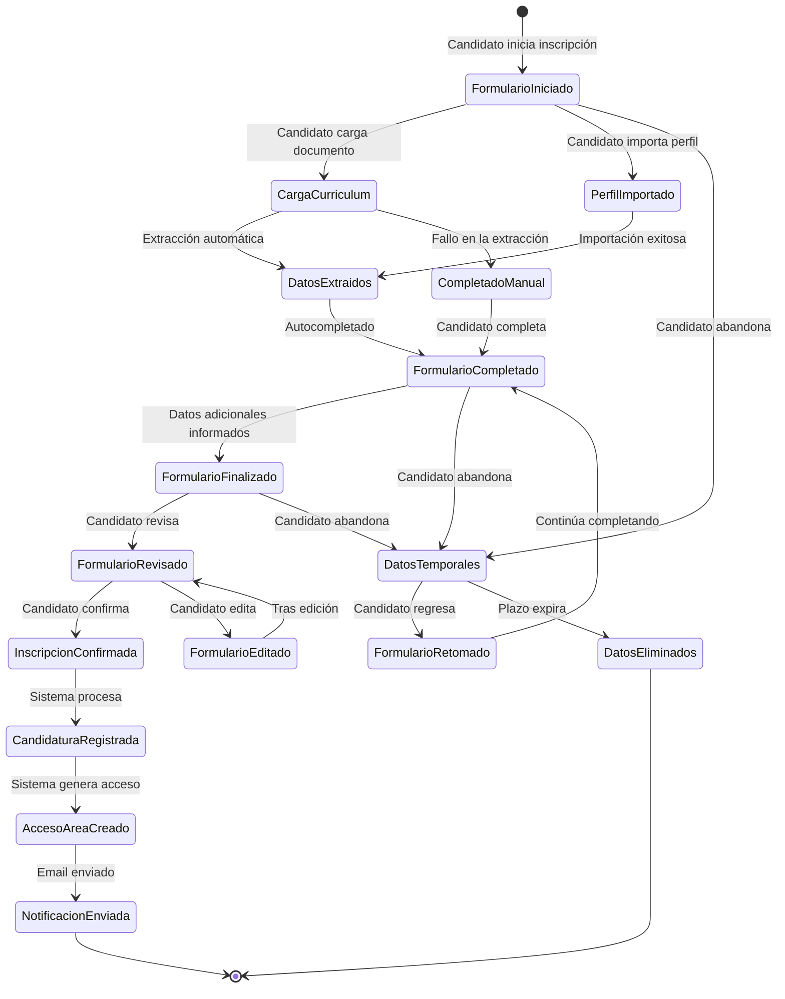

## Post-Condiciones

- Candidatura registrada en el sistema
- Perfil del candidato almacenado para futuras oportunidades
- Candidato con acceso al área de seguimiento
- Candidatura disponible para análisis en el pipeline de reclutamiento

## Requisitos Especiales

- Tiempo de carga de página inferior a 3 segundos
- Extracción de datos del currículum con precisión mínima del 85%
- Compatibilidad con los formatos más comunes de currículum (PDF, DOCX, TXT)
- Conformidad con LGPD/GDPR para tratamiento de datos personales

## Frecuencia de Uso

- Alta, proceso continuo durante períodos de reclutamiento
- Picos esperados tras publicación de nuevas vacantes

## Métricas de Éxito

- Tasa de finalización del proceso de inscripción > 80%
- Tiempo medio de inscripción < 5 minutos
- Satisfacción del candidato con el proceso > 4/5
- Reducción del 70% en el tiempo de procesamiento inicial de candidaturas

## Pantallas Principales

1. Listado de Vacantes
2. Detalles de la Vacante
3. Formulario de Inscripción
4. Confirmación de Inscripción
5. Área de Seguimiento de Candidatura

# Caso de Uso 2: Pipeline de Reclutamiento

## Visión General

El módulo de Pipeline de Reclutamiento es el centro operacional del sistema LTI, permitiendo que los reclutadores gestionen todo el flujo de candidaturas de forma visual y eficiente. Este componente integra funcionalidades de gestión de etapas del proceso selectivo y comunicación con candidatos, automatizando tareas repetitivas y proporcionando visibilidad completa del progreso de los candidatos.

## Objetivos

- Proporcionar una visualización clara y personalizable del embudo de reclutamiento
- Permitir gestión eficiente de candidatos en diferentes etapas del proceso
- Automatizar comunicaciones con candidatos sobre actualizaciones de estado
- Facilitar la programación y feedback de entrevistas
- Proporcionar insights sobre el progreso y cuellos de botella del proceso selectivo

## Actores Principales

- **Reclutador**: Usuario responsable de gestionar candidaturas y conducir el proceso selectivo
- **Gerente de RRHH**: Usuario que supervisa el proceso de reclutamiento como un todo
- **Sistema**: Procesos automatizados de notificaciones y actualizaciones
- **Candidato**: Usuario que recibe comunicaciones e interacciones (interfaz con Caso de Uso 1)

## Diagrama de Clases UML

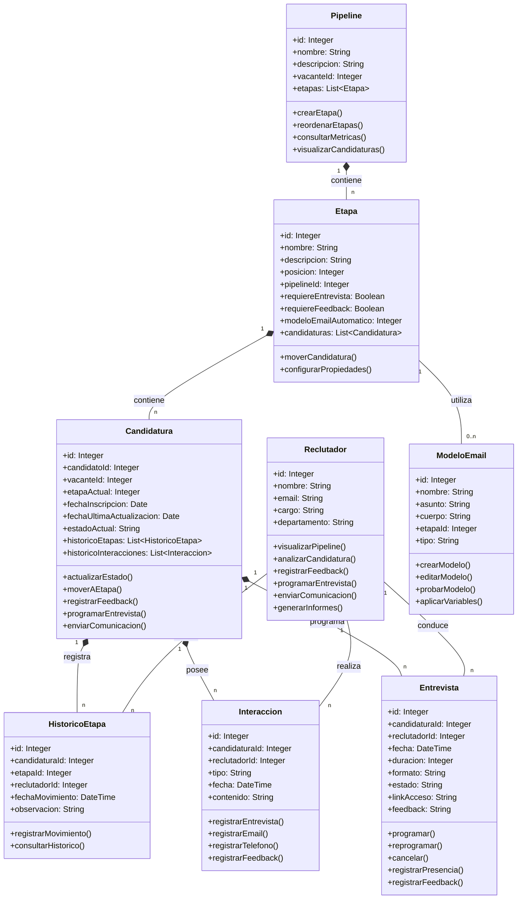

## Pre-Condiciones

- Candidaturas registradas en el sistema
- Etapas del proceso selectivo configuradas
- Modelos de comunicación predefinidos

## Flujo Principal

1. Reclutador accede al panel del Pipeline de Reclutamiento
2. Sistema muestra visión Kanban de las candidaturas por etapa del proceso
3. Reclutador visualiza información resumida de los candidatos en cada etapa
4. Reclutador selecciona una candidatura para análisis detallado
5. Sistema presenta perfil completo, histórico de interacciones y evaluaciones
6. Reclutador analiza información y decide próximos pasos
7. Reclutador mueve candidatura a la siguiente etapa (o rechaza)
8. Sistema envía comunicación automática al candidato sobre el cambio de estado
9. Sistema solicita programación de entrevista si aplica a la etapa
10. Reclutador registra feedback tras interacciones
11. Sistema actualiza estado y métricas del proceso selectivo

## Diagrama de Flujo del Proceso

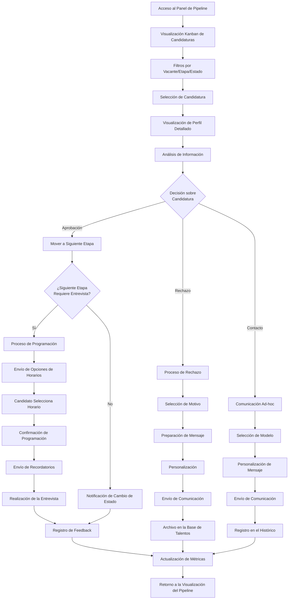

## Flujos Alternativos

### A1: Programación de entrevista
1. Sistema envía sugerencias de horarios disponibles al candidato
2. Candidato selecciona horario preferido
3. Sistema confirma programación para candidato y reclutador
4. Sistema envía recordatorios automáticos próximos a la fecha

### A2: Rechazo de candidatura
1. Reclutador selecciona motivo del rechazo en lista predefinida
2. Sistema prepara email de feedback conforme al modelo asociado al motivo
3. Reclutador personaliza mensaje si necesario
4. Sistema envía comunicación al candidato
5. Sistema mueve candidatura a base de talentos con etiquetas apropiadas

### A3: Comunicación ad-hoc con candidato
1. Reclutador inicia nueva comunicación
2. Sistema ofrece modelos de mensaje conforme al contexto
3. Reclutador personaliza y envía mensaje
4. Sistema registra comunicación en el histórico del candidato

## Diagrama de Secuencia

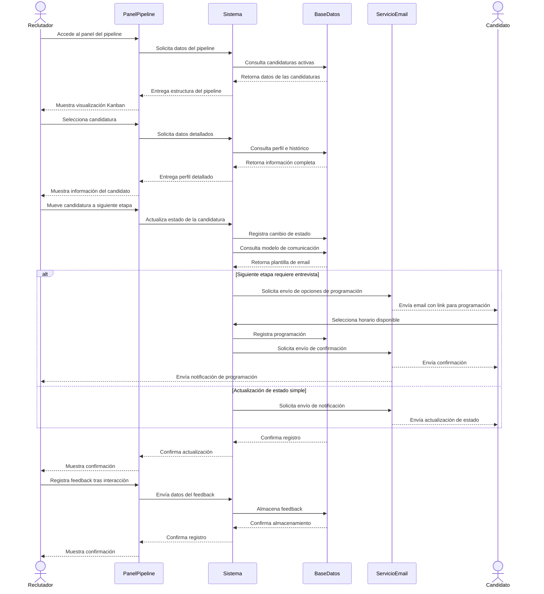

## Diagrama de Estados de la Candidatura

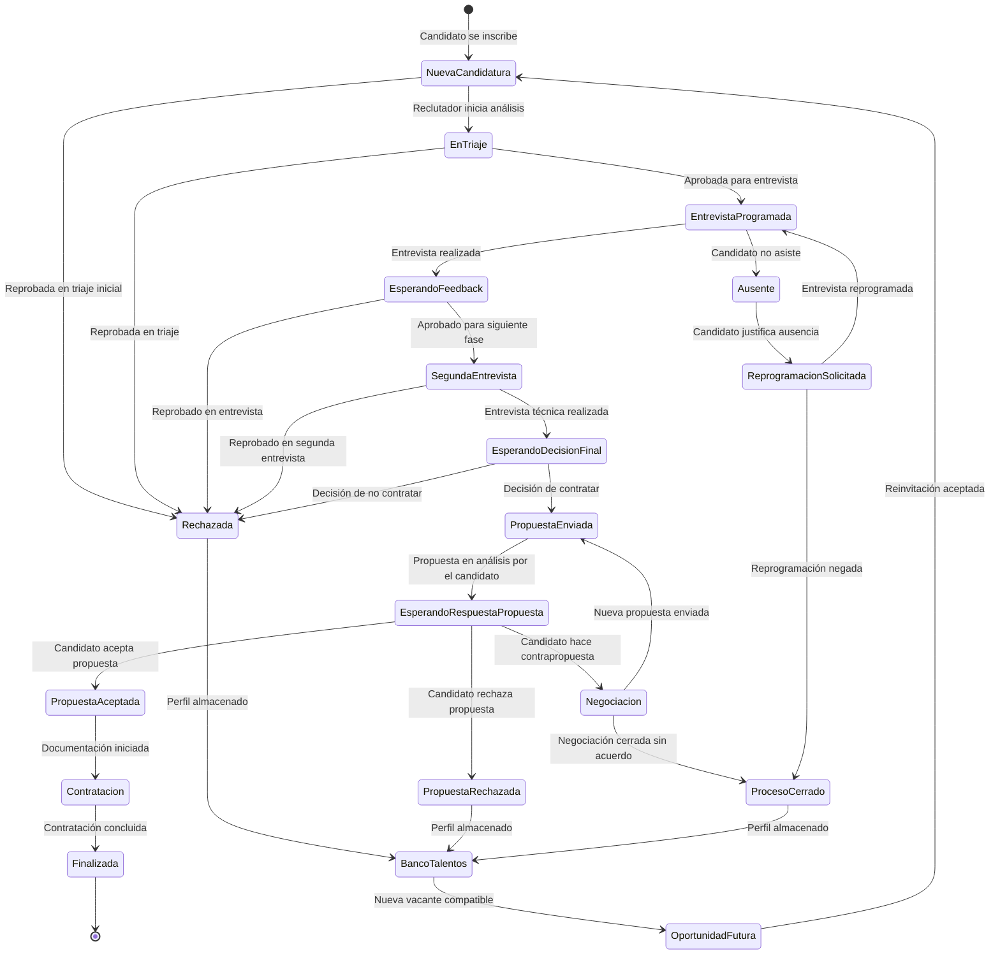

## Post-Condiciones

- Estado de la candidatura actualizado
- Comunicación enviada al candidato
- Histórico de interacciones registrado
- Métricas del proceso selectivo actualizadas

## Requisitos Especiales

- Interfaz responsiva con actualización en tiempo real
- Capacidad de personalización del pipeline por vacante o departamento
- Tiempo de respuesta inferior a 2 segundos para movimiento de candidatos
- Conformidad con LGPD/GDPR para todas las comunicaciones

## Frecuencia de Uso

- Alta, utilización diaria por reclutadores y gestores de RRHH
- Intensidad varía conforme al volumen de procesos selectivos activos

## Métricas de Éxito

- Reducción del 60% en el tiempo de respuesta a candidatos
- Aumento del 40% en la tasa de conversión entre etapas del proceso
- Reducción del 50% en el tiempo medio de cobertura de vacantes
- Satisfacción de los reclutadores con el sistema > 4.5/5

# Caso de Uso 3: Filtrado Básico

## Visión General

El módulo de Filtrado Básico proporciona las capacidades iniciales de Clasificación Cognitiva para el sistema LTI, permitiendo filtrar automáticamente candidaturas según su relevancia para cada vacante. Este componente optimiza el proceso de selección mediante la identificación de los candidatos más adecuados, ahorrando tiempo valioso a los reclutadores y mejorando la calidad de las contrataciones.

## Objetivos

- Automatizar la clasificación inicial de candidaturas según su relevancia para cada vacante
- Proporcionar filtros configurables por palabras clave y requisitos
- Establecer un sistema de puntuación y ordenación de candidatos
- Permitir el descubrimiento eficiente de talentos adecuados en grandes volúmenes de candidaturas
- Reducir el tiempo dedicado a la revisión manual de currículums

## Actores Principales

- **Sistema**: Procesos automatizados de filtrado y clasificación
- **Recrutador**: Usuario que configura criterios y utiliza los resultados del filtrado
- **Gerente de RRHH**: Usuario que supervisa la eficacia de los criterios de filtrado
- **Candidato**: Usuario cuyo perfil es analizado (interfaz con Caso de Uso 1)

## Diagrama de Clases UML

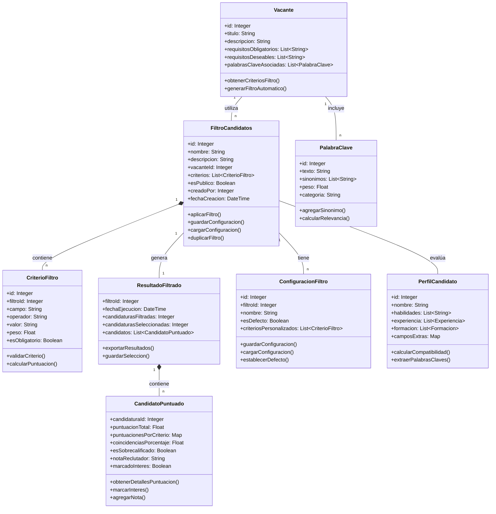

## Pré-Condiciones

- Candidaturas registradas en el sistema con datos estructurados
- Vacantes con requisitos claramente definidos
- Criterios de filtrado predefinidos o configurables

## Flujo Principal

1. Reclutador accede al módulo de Filtrado Básico para una vacante específica
2. Sistema presenta opciones de configuración de filtros
3. Reclutador selecciona/configura criterios de filtrado (experiencia, habilidades, formación, etc.)
4. Reclutador establece pesos para cada criterio según su importancia
5. Sistema procesa todas las candidaturas aplicando los criterios configurados
6. Sistema calcula puntuación para cada candidato basado en la correspondencia con los requisitos
7. Sistema presenta candidaturas ordenadas por relevancia
8. Reclutador visualiza resultados y puede aplicar filtros adicionales
9. Reclutador marca candidatos de interés para revisión detallada
10. Sistema guarda la configuración de filtros para uso futuro

## Diagrama de Flujo del Proceso

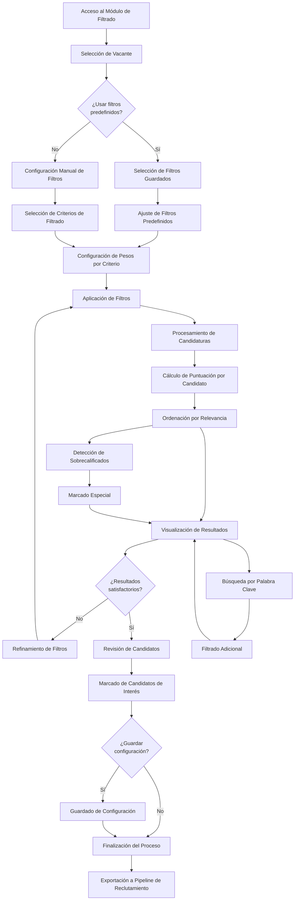

## Flujos Alternativos

### A1: Filtros predefinidos
1. Reclutador selecciona un conjunto de filtros guardados previamente
2. Sistema aplica configuración automáticamente
3. Reclutador realiza ajustes si es necesario

### A2: Búsqueda específica por palabra clave
1. Reclutador ingresa términos de búsqueda específicos
2. Sistema filtra candidaturas que contienen los términos en cualquier campo relevante
3. Sistema presenta resultados resaltando donde aparecen los términos

### A3: Detección de candidatos sobrecalificados
1. Sistema identifica candidatos con cualificaciones sustancialmente superiores a los requisitos
2. Sistema marca estos perfiles con indicador especial
3. Reclutador decide si considera estos perfiles o los reserva para otras vacantes

## Diagrama de Secuencia

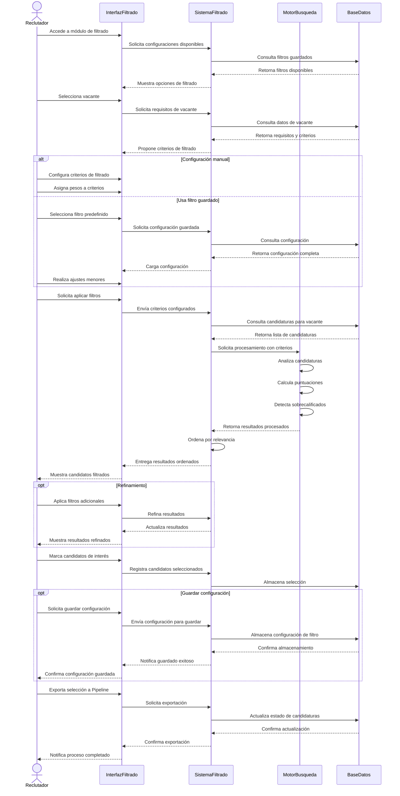

## Diagrama de Estados de la Candidatura

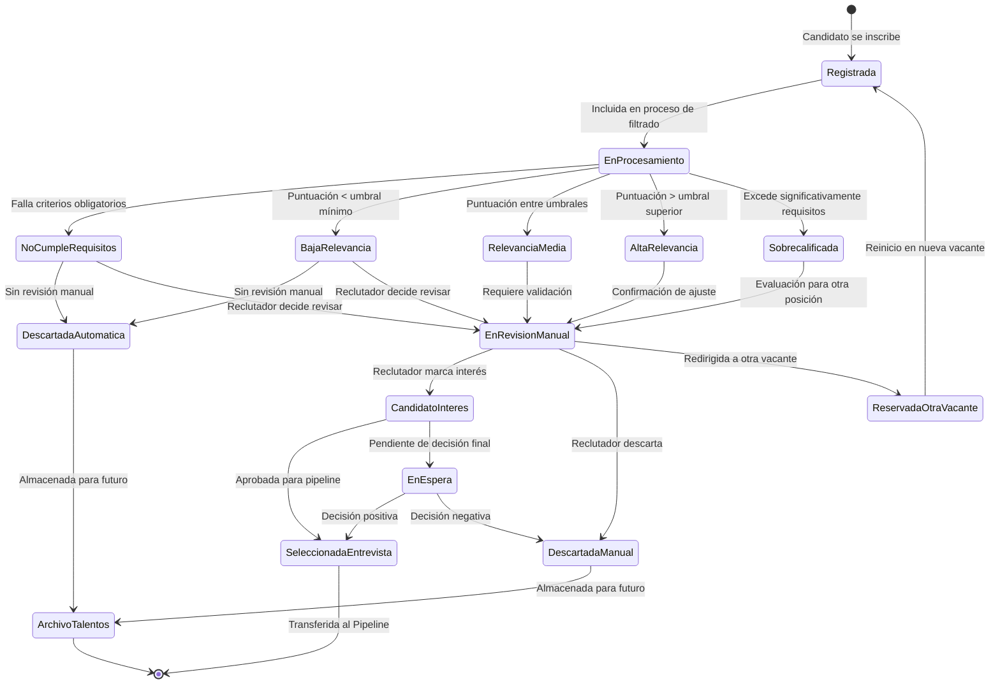

## Post-Condiciones

- Candidaturas clasificadas y ordenadas por relevancia
- Candidatos de interés marcados para revisión detallada
- Configuración de filtros guardada para futuras búsquedas
- Datos preparados para uso en el Pipeline de Reclutamiento

## Requisitos Especiales

- Procesamiento de filtros en menos de 5 segundos para hasta 1000 candidaturas
- Capacidad de reconocer variaciones terminológicas y sinónimos
- Interfaz intuitiva para configuración de criterios complejos
- Explicabilidad de los resultados (mostrar por qué un candidato recibió determinada puntuación)

## Frecuencia de Uso

- Alta, especialmente durante la fase inicial de procesos de selección
- Utilización recurrente para refinar resultados y descubrir candidatos adecuados

## Métricas de Éxito

- Reducción del 70% en tiempo dedicado a la revisión inicial de candidaturas
- Tasa de coincidencia superior al 85% entre candidatos destacados automáticamente y seleccionados por reclutadores
- Aumento del 40% en la calidad de las entrevistas (candidatos mejor preseleccionados)
- Satisfacción de los reclutadores con las recomendaciones > 4/5

# Modelo de Datos - Sistema ATS LTI

A continuación se presenta el modelo de datos diseñado para soportar los tres casos de uso principales del sistema LTI:
1. Portal de Candidatos (Inscripción y Gestión de Candidatos)
2. Pipeline de Reclutamiento (Gestión de Pipeline + Comunicación)
3. Filtrado Básico (elementos iniciales de la Clasificación Cognitiva)

## Diagrama Entidad-Relación

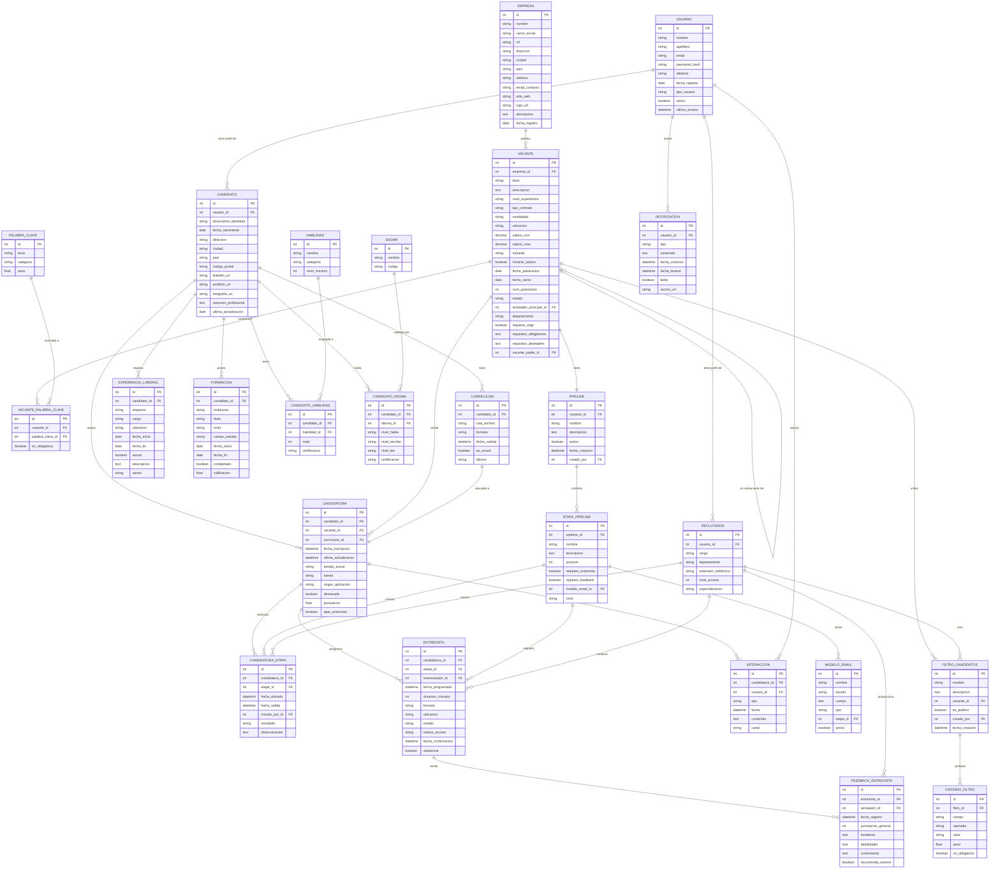

## Descripción de Entidades Principales

### Gestión de Usuarios y Perfiles

- **USUARIO**: Entidad base para todos los usuarios del sistema (candidatos, reclutadores, administradores)
- **CANDIDATO**: Perfil específico para postulantes a vacantes
- **RECLUTADOR**: Perfil para profesionales de RRHH que gestionan procesos de selección
- **EMPRESA**: Organizaciones que publican vacantes

### Portal de Candidatos

- **CURRICULUM**: Documentos CV subidos por los candidatos
- **EXPERIENCIA_LABORAL**: Historial profesional de los candidatos
- **FORMACION**: Estudios y títulos académicos
- **HABILIDAD** y **CANDIDATO_HABILIDAD**: Competencias técnicas y blandas
- **IDIOMA** y **CANDIDATO_IDIOMA**: Habilidades lingüísticas
- **CANDIDATURA**: Postulaciones a vacantes específicas

### Pipeline de Reclutamiento

- **VACANTE**: Posiciones laborales abiertas
- **PIPELINE**: Flujo de trabajo para cada proceso de selección
- **ETAPA_PIPELINE**: Fases del proceso (p.ej., screening, entrevista técnica, etc.)
- **CANDIDATURA_ETAPA**: Seguimiento del progreso de candidatos en el pipeline
- **ENTREVISTA**: Programación de reuniones con candidatos
- **FEEDBACK_ENTREVISTA**: Evaluaciones post-entrevista
- **INTERACCION**: Comunicaciones con candidatos
- **MODELO_EMAIL**: Plantillas para comunicaciones automatizadas
- **NOTIFICACION**: Alertas para usuarios del sistema

### Filtrado Básico

- **PALABRA_CLAVE**: Términos relevantes para búsqueda y clasificación
- **VACANTE_PALABRA_CLAVE**: Asociación de términos clave a vacantes
- **FILTRO_CANDIDATOS**: Configuraciones de búsqueda y filtrado
- **CRITERIO_FILTRO**: Parámetros específicos para cada filtro

## Consideraciones Técnicas

1. **Escalabilidad**: El modelo está diseñado para soportar grandes volúmenes de candidaturas
2. **Flexibilidad**: Permite configuración personalizada de pipelines y criterios de filtrado
3. **Trazabilidad**: Mantiene histórico completo de interacciones y movimientos en el proceso
4. **Seguridad**: Segregación de perfiles y niveles de acceso
5. **Cumplimiento normativo**: Estructura compatible con regulaciones de protección de datos (LGPD/GDPR)

## Soporte a Casos de Uso

### Caso de Uso 1: Portal de Candidatos
Soportado principalmente por las entidades USUARIO, CANDIDATO, CURRICULUM, más todas las entidades relacionadas con el perfil profesional y la CANDIDATURA.

### Caso de Uso 2: Pipeline de Reclutamiento
Implementado a través de PIPELINE, ETAPA_PIPELINE, CANDIDATURA_ETAPA, ENTREVISTA, INTERACCION y entidades relacionadas.

### Caso de Uso 3: Filtrado Básico
Construido sobre las entidades FILTRO_CANDIDATOS, CRITERIO_FILTRO, PALABRA_CLAVE y sus relaciones con VACANTE y CANDIDATURA.

# Arquitectura del Sistema LTI - Diseño de Alto Nivel

## 1. Visión General

El sistema LTI (Lean Talent Intelligence) está diseñado como una plataforma moderna de gestión de candidatos utilizando una arquitectura de microservicios, con interfaces web responsivas y APIs RESTful. Esta arquitectura permite escalabilidad, mantenibilidad y la capacidad de evolucionar con nuevas características de inteligencia artificial a medida que el sistema madure.

## 2. Arquitectura General

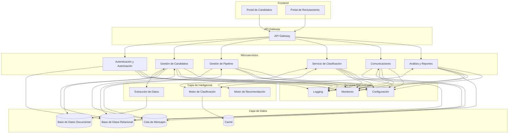

## 3. Componentes Principales

### 3.1. Frontend

El frontend está compuesto por dos interfaces principales:

- **Portal de Candidatos**: Interfaz pública donde los candidatos pueden registrarse, crear perfiles, subir currículums y postularse a vacantes.
- **Portal de Reclutamiento**: Interfaz interna para reclutadores y gerentes de RRHH donde gestionan vacantes, configuran pipelines, evalúan candidatos y administran todo el proceso de selección.

Ambas interfaces están construidas como aplicaciones web progresivas (PWA), permitiendo acceso responsivo desde cualquier dispositivo.

### 3.2. Backend

La capa de backend se divide en varios microservicios especializados:

- **Servicio de Autenticación y Autorización**: Gestiona la identidad de usuarios, registro, inicio de sesión y control de acceso.
- **Servicio de Gestión de Candidatos**: Administra perfiles, currículums y postulaciones.
- **Servicio de Pipeline**: Gestiona el flujo de trabajo del proceso de selección con sus diferentes etapas.
- **Servicio de Clasificación**: Implementa los algoritmos de filtrado y puntuación de candidatos.
- **Servicio de Comunicación**: Gestiona plantillas de correo, notificaciones y comunicaciones con candidatos.
- **Servicio de Análisis**: Proporciona métricas, informes y análisis del proceso de reclutamiento.

### 3.3. Capa de Inteligencia

- **Motor de Extracción de Datos**: Procesa currículums para extraer información estructurada.
- **Motor de Clasificación**: Analiza la compatibilidad entre candidatos y vacantes.
- **Motor de Recomendación**: Sugiere candidatos adecuados para vacantes específicas.

### 3.4. Capa de Datos

- **Base de Datos Relacional**: Almacena datos estructurados como perfiles, vacantes, configuraciones.
- **Base de Datos Documental**: Almacena documentos como currículums y otros archivos no estructurados.
- **Caché**: Mejora el rendimiento almacenando resultados frecuentes de consultas.
- **Cola de Mensajes**: Facilita la comunicación asíncrona entre servicios.

### 3.5. Servicios Transversales

- **Gateway API**: Punto de entrada único para todas las peticiones al backend.
- **Servicio de Logging**: Registra eventos y errores del sistema.
- **Servicio de Monitoreo**: Supervisa el rendimiento y la salud del sistema.
- **Servicio de Configuración**: Centraliza la configuración de todos los servicios.

## 4. Diagrama Detallado de Componentes

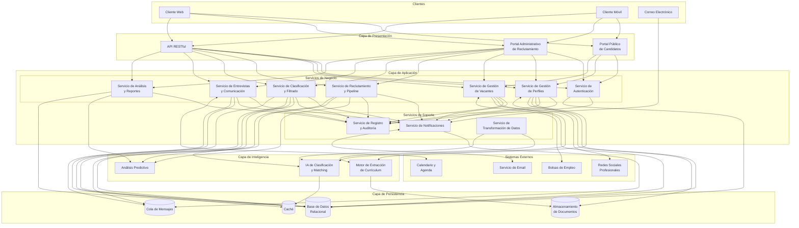

## 5. Diagrama de Despliegue

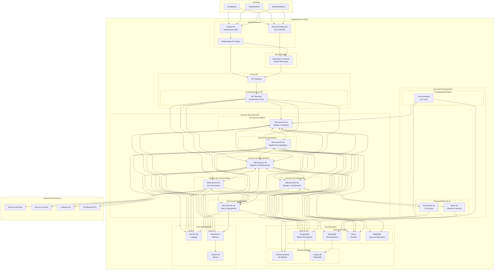

## 6. Flujo de Datos Principal

1. Los candidatos acceden al Portal de Candidatos donde crean perfiles y se postulan a vacantes.
2. El Servicio de Gestión de Candidatos procesa los datos y currículums, utilizando el Motor de Extracción para estructurar la información.
3. El Servicio de Clasificación evalúa las candidaturas contra los requisitos de la vacante.
4. Los reclutadores acceden al Portal de Reclutamiento para revisar candidaturas filtradas y organizadas.
5. El Servicio de Pipeline gestiona el movimiento de candidatos a través de las diferentes etapas del proceso.
6. El Servicio de Comunicación envía notificaciones automáticas cuando ocurren cambios de estado.
7. El Servicio de Análisis recopila datos de todo el proceso para generar informes y métricas.

## 7. Tecnologías Recomendadas

### 7.1. Frontend
- **Framework**: React.js con TypeScript
- **UI Components**: Material UI o Tailwind CSS
- **Estado**: Redux o Context API
- **Comunicación API**: Axios o React Query

### 7.2. Backend
- **Lenguaje**: Node.js (Express) o Java (Spring Boot)
- **API**: RESTful con OpenAPI/Swagger
- **Autenticación**: OAuth 2.0 / JWT

### 7.3. Bases de Datos
- **Relacional**: PostgreSQL
- **Documental**: MongoDB
- **Caché**: Redis
- **Cola de Mensajes**: RabbitMQ o Kafka

### 7.4. Inteligencia Artificial
- **Procesamiento de Lenguaje Natural**: spaCy o NLTK
- **Extracción de Datos**: TensorFlow o PyTorch para modelos de ML
- **Algoritmos de Matching**: Algoritmos de similitud coseno y técnicas de ML supervisado

### 7.5. Infraestructura
- **Contenedores**: Docker
- **Orquestación**: Kubernetes
- **CI/CD**: Jenkins o GitHub Actions
- **Monitoreo**: Prometheus y Grafana
- **Logging**: ELK Stack (Elasticsearch, Logstash, Kibana)

## 8. Consideraciones Importantes

### 8.1. Escalabilidad
- Arquitectura de microservicios para escalar componentes de forma independiente
- Bases de datos con particionamiento para manejar grandes volúmenes de datos
- Procesamiento asíncrono para tareas intensivas como la extracción de datos de currículums
- Caché distribuida para mejorar el rendimiento de operaciones frecuentes
- Balanceo de carga para distribuir el tráfico entre instancias

### 8.2. Seguridad
- Autenticación multi-factor para accesos críticos
- Encriptación de datos sensibles en reposo y en tránsito
- Validación de entradas y salidas en todos los endpoints API
- Control de acceso basado en roles (RBAC)
- Auditoría completa de acciones críticas
- Cumplimiento con LGPD/GDPR para datos personales

### 8.3. Mantenibilidad
- Documentación completa de APIs con OpenAPI/Swagger
- Pruebas automatizadas para todos los componentes
- Registro detallado de eventos para facilitar la depuración
- Despliegue continuo con posibilidad de rollback
- Separación clara de responsabilidades entre servicios

### 8.4. Extensibilidad
- Arquitectura modular que permite añadir nuevos servicios
- APIs versionadas para evolucionar sin romper compatibilidad
- Eventos y mensajería para desacoplar componentes
- Configuración centralizada para modificar comportamiento sin redespliegues

## 9. Plan de Implementación para MVP

1. **Fase 1**: Implementación del Portal de Candidatos y Gestión de Perfiles
2. **Fase 2**: Desarrollo del Pipeline de Reclutamiento básico
3. **Fase 3**: Implementación del Filtrado Básico
4. **Fase 4**: Integración de componentes y pruebas end-to-end
5. **Fase 5**: Despliegue del MVP con monitoreo inicial

Cada fase incluye ciclos de desarrollo, pruebas y refinamiento con retroalimentación de usuarios clave.

# Diagrama C4 del Servicio de Clasificación y Filtrado - LTI

## Diagrama C4

```mermaid
graph TB
    subgraph "Nivel 1: Contexto del Sistema"
        RC[Reclutador] -.-> |"Configura filtros<br>y revisa resultados"| SCF
        CA[Candidato] -.-> |"Se postula<br>a vacantes"| SGC
        
        subgraph "Sistema LTI"
            SGC[Servicio de<br>Gestión de Candidatos]
            SCF[Servicio de<br>Clasificación y Filtrado]
            SRP[Servicio de<br>Pipeline de Reclutamiento]
            
            SGC --> |"Envía candidaturas<br>para evaluación"| SCF
            SCF --> |"Envía candidatos<br>clasificados"| SRP
        end
    end
    
    subgraph "Nivel 2: Contenedores del Servicio de Clasificación"
        subgraph "Servicio de Clasificación y Filtrado"
            APICL[API de Clasificación]
            WSCL[Workers de Clasificación]
            MLCL[Módulo de ML]
            BDCL[(Base de Datos<br>de Clasificación)]
            CACL[(Caché de<br>Resultados)]
            
            APICL <--> WSCL
            WSCL <--> MLCL
            WSCL <--> BDCL
            MLCL <--> CACL
            APICL <--> CACL
        end
        
        APIG[API Gateway] --> APICL
        APICL --> SGCAPI[API Gestión<br>de Candidatos]
        APICL --> SRPAPI[API Pipeline<br>de Reclutamiento]
        MLCL <--> S3[Almacenamiento<br>de Modelos]
    end
    
    subgraph "Nivel 3: Componentes"
        subgraph "API de Clasificación"
            GF[Gestor de<br>Filtros]
            GC[Gestor de<br>Configuración]
            EM[Evaluador de<br>Matching]
            PC[Procesador de<br>Consultas]
            
            GF <--> GC
            GF <--> EM
            EM <--> PC
            GC <--> PC
        end
        
        subgraph "Workers de Clasificación"
            PB[Procesador<br>por Lotes]
            PR[Procesador en<br>Tiempo Real]
            GE[Gestor de<br>Encolamiento]
            MO[Monitor de<br>Operaciones]
            
            PB <--> GE
            PR <--> GE
            PB <--> MO
            PR <--> MO
        end
        
        subgraph "Módulo de ML"
            PF[Preprocesador<br>de Features]
            MA[Modelo de<br>Afinidad]
            MH[Modelo de<br>Habilidades]
            MP[Modelo<br>Predictivo]
            EV[Evaluador de<br>Precisión]
            
            PF --> MA & MH & MP
            MA & MH & MP --> EV
        end
        
        GF <--> PB & PR
        EM <--> MA & MH & MP
        PC <--> CACL
        MO <--> LOG[Servicio de<br>Logging]
    end
    
    subgraph "Nivel 4: Código (Componente de Afinidad)"
        subgraph "Modelo de Afinidad"
            TP[Tokenizador de<br>Perfiles]
            CV[Conversor<br>Vectorial]
            MC[Matriz de<br>Coincidencia]
            CP[Calculador de<br>Puntuación]
            
            TP --> CV
            CV --> MC
            MC --> CP
        end
        
        EXTDATA[Extractor de<br>Datos CV] --> TP
        REQ[Requisitos de<br>Vacante] --> CV
        CP --> |"Puntuación<br>de Match"| RANKER[Sistema de<br>Ranking]
    end
    
    classDef context fill:#C4F5FF,stroke:#0099CC,color:#003366
    classDef container fill:#B3E6CC,stroke:#339966,color:#003300
    classDef component fill:#FFE6CC,stroke:#FF9933,color:#663300
    classDef code fill:#F5E6FF,stroke:#9966CC,color:#330066
    
    class RC,CA context
    class APICL,WSCL,MLCL,BDCL,CACL,APIG,SGCAPI,SRPAPI,S3 container
    class GF,GC,EM,PC,PB,PR,GE,MO,PF,MA,MH,MP,EV,LOG component
    class TP,CV,MC,CP,EXTDATA,REQ,RANKER code
```

## Descripción General

Este diagrama C4 muestra una descomposición progresiva del Servicio de Clasificación y Filtrado del sistema LTI, siguiendo la metodología C4 (Contexto, Contenedores, Componentes y Código). Este enfoque permite visualizar la arquitectura desde diferentes niveles de abstracción, comenzando con una visión general del sistema hasta llegar a un detalle específico de implementación.

## Nivel 1: Contexto del Sistema

En este nivel se muestra cómo el Servicio de Clasificación y Filtrado se relaciona con otros elementos principales del sistema LTI:

- **Usuarios principales**: Reclutadores que configuran filtros y Candidatos que se postulan a vacantes
- **Servicios relacionados**: 
  - Servicio de Gestión de Candidatos (envía candidaturas para evaluación)
  - Servicio de Pipeline de Reclutamiento (recibe candidatos clasificados)

## Nivel 2: Contenedores

Este nivel descompone el Servicio de Clasificación y Filtrado en sus principales contenedores:

- **API de Clasificación**: Interfaz REST que expone las funcionalidades del servicio
- **Workers de Clasificación**: Procesadores que ejecutan las tareas de clasificación
- **Módulo de Machine Learning**: Contiene los modelos de IA para clasificación
- **Base de Datos de Clasificación**: Almacena configuraciones, filtros y resultados
- **Caché de Resultados**: Mejora el rendimiento almacenando resultados frecuentes

Además, se muestran las interacciones con elementos externos como:
- API Gateway (punto de entrada)
- APIs de otros servicios (Gestión de Candidatos, Pipeline)
- Almacenamiento de Modelos (para persisitencia de modelos entrenados)

## Nivel 3: Componentes

Este nivel detalla los componentes internos de cada contenedor:

### API de Clasificación:
- **Gestor de Filtros**: Administra las configuraciones de filtrado
- **Gestor de Configuración**: Maneja parámetros del sistema
- **Evaluador de Matching**: Determina la compatibilidad candidato-vacante
- **Procesador de Consultas**: Maneja las peticiones de búsqueda y filtrado

### Workers de Clasificación:
- **Procesador por Lotes**: Ejecuta tareas de clasificación masiva
- **Procesador en Tiempo Real**: Maneja solicitudes inmediatas
- **Gestor de Encolamiento**: Administra colas de tareas
- **Monitor de Operaciones**: Supervisa rendimiento y errores

### Módulo de ML:
- **Preprocesador de Features**: Transforma datos para modelos ML
- **Modelo de Afinidad**: Evalúa compatibilidad general
- **Modelo de Habilidades**: Identifica y valida competencias
- **Modelo Predictivo**: Predice probabilidad de éxito en el proceso
- **Evaluador de Precisión**: Monitorea calidad de las predicciones

## Nivel 4: Código (Componente de Afinidad)

Este nivel profundiza en la implementación del Modelo de Afinidad:

- **Tokenizador de Perfiles**: Procesa textos de CV y vacantes
- **Conversor Vectorial**: Transforma texto a vectores numéricos
- **Matriz de Coincidencia**: Calcula similitudes entre vectores
- **Calculador de Puntuación**: Determina puntaje final de compatibilidad

También se muestran las entradas (Extractor de Datos CV, Requisitos de Vacante) y la salida principal (Sistema de Ranking).

## Beneficios de este Diseño

1. **Separación de responsabilidades**: Cada componente tiene una función específica
2. **Escalabilidad**: Permite escalar independientemente los workers y modelos ML
3. **Flexibilidad**: Facilita la actualización de los modelos sin afectar a la API
4. **Rendimiento**: Utiliza procesamiento en tiempo real y por lotes según necesidades
5. **Mantenibilidad**: Estructura modular facilita pruebas y actualizaciones
6. **Evolución**: Permite mejorar progresivamente los algoritmos de clasificación

## Tecnologías Sugeridas para Implementación

- **API**: Node.js/Express o Python/FastAPI
- **Workers**: Celery o AWS Lambda
- **ML**: Python con TensorFlow/PyTorch/scikit-learn
- **Almacenamiento**: PostgreSQL para datos estructurados, MongoDB para documentos
- **Comunicación**: REST para sincrónico, RabbitMQ para asincrónico
- **Despliegue**: Contenedores Docker orquestados con Kubernetes
- **Procesamiento de Texto**: spaCy o NLTK para NLP