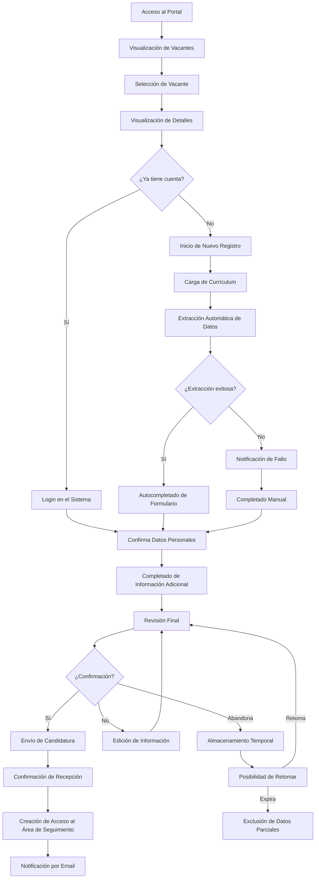
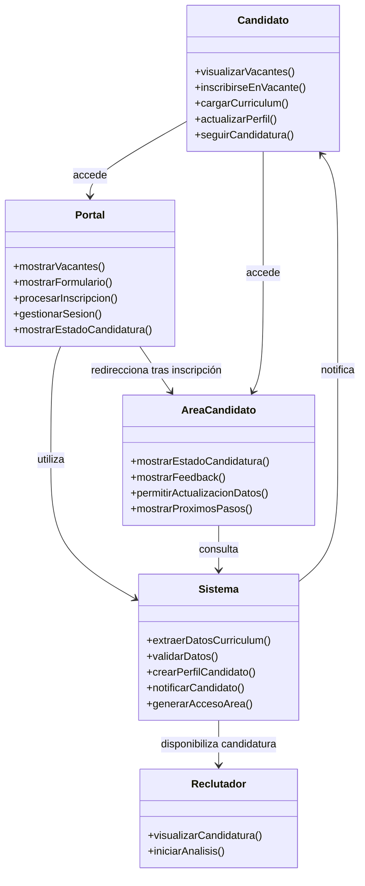
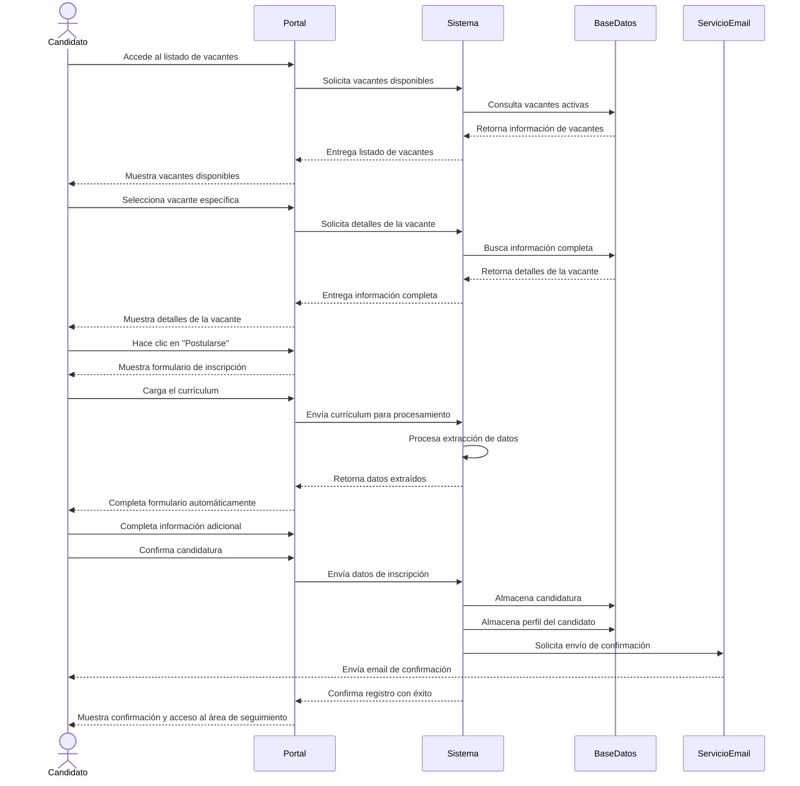
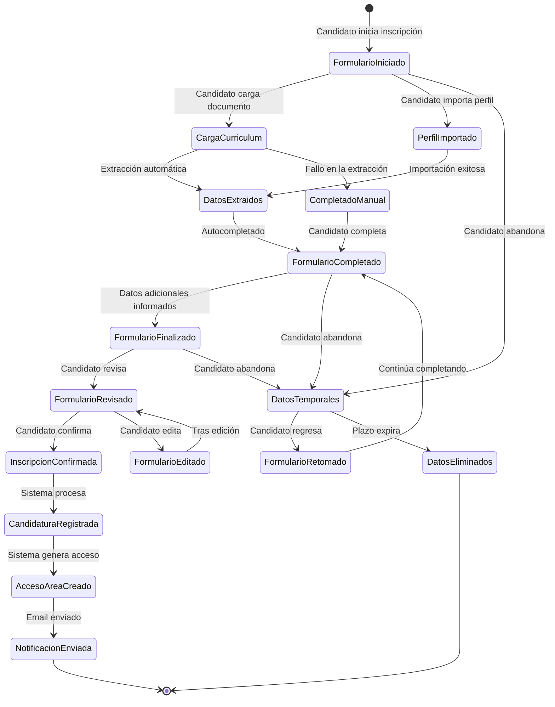
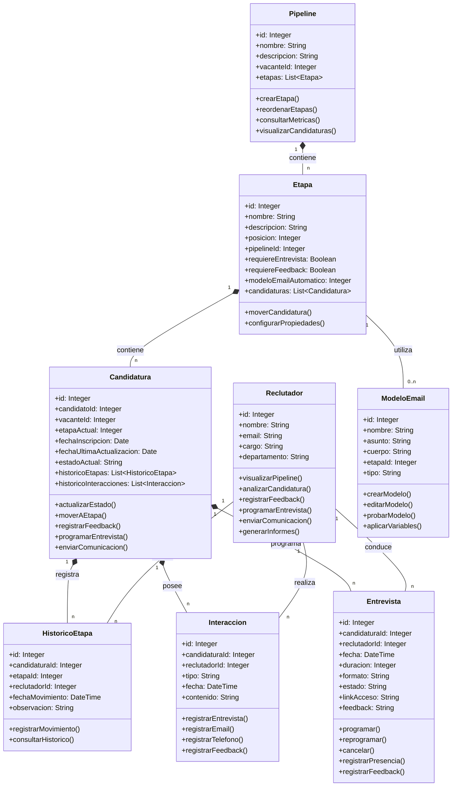
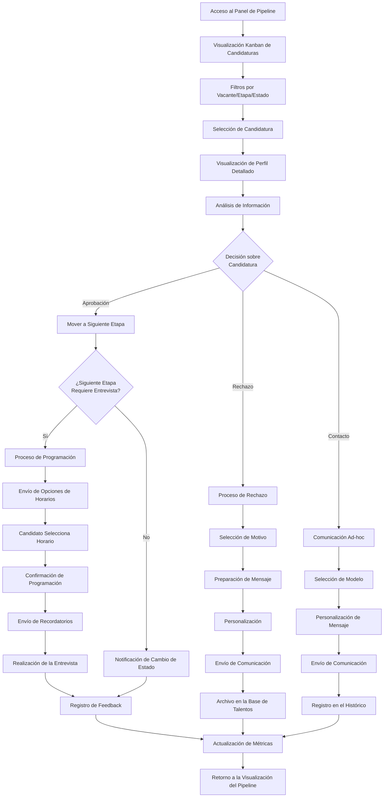
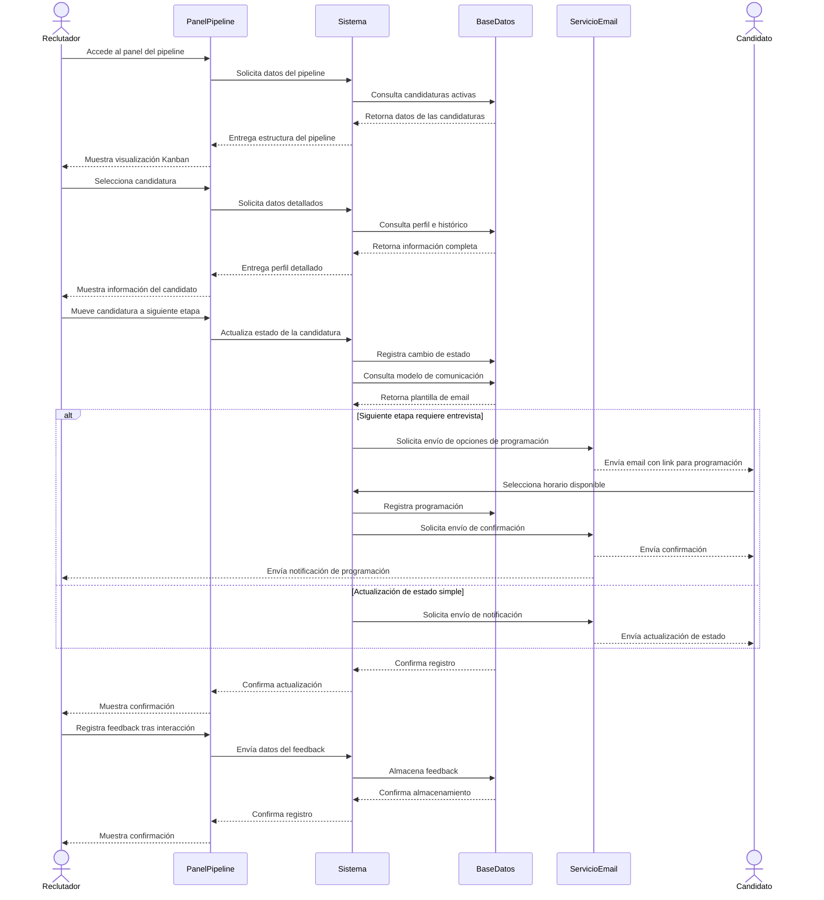
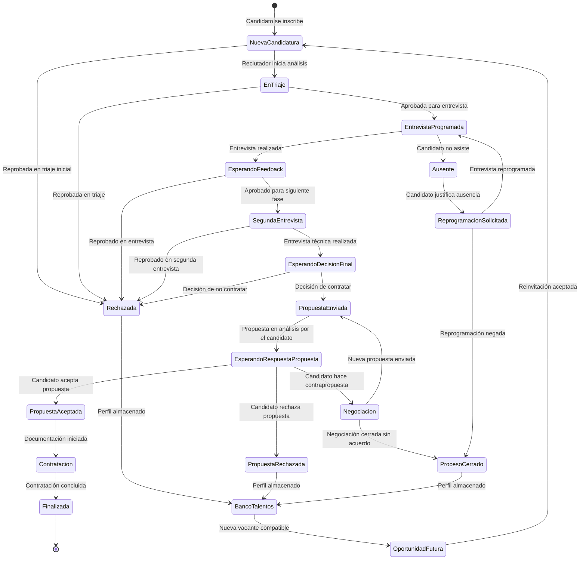
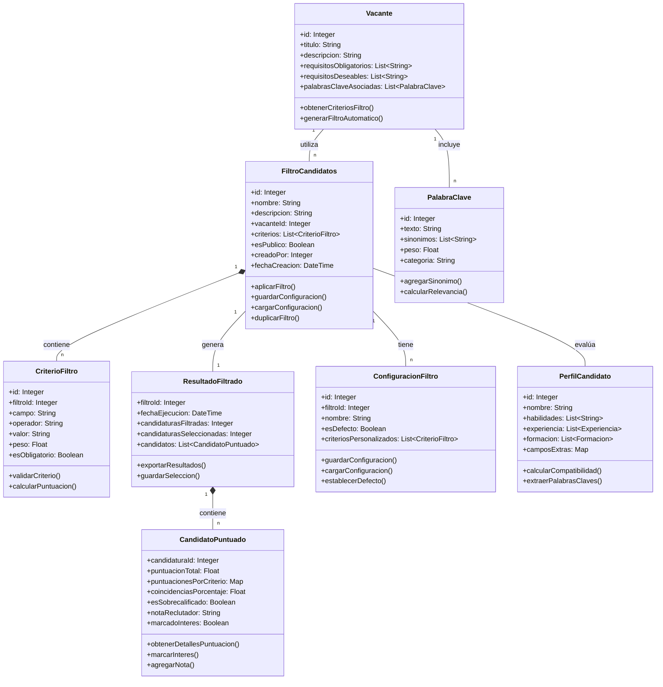
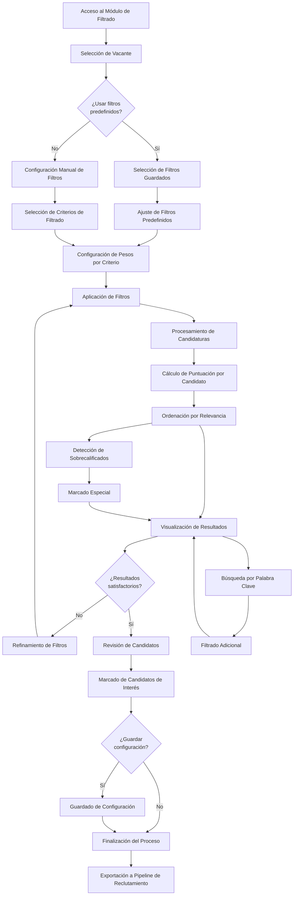

#
# LTI - Sistema Avançado de Gestão de Talentos

## Descrição Breve
LTI (Lean Talent Intelligence) é uma plataforma inovadora de Applicant Tracking System (ATS) projetada para otimizar e humanizar o processo de recrutamento e seleção. Desenvolvida com foco na experiência do recrutador e do candidato, a LTI utiliza inteligência artificial avançada para simplificar tarefas repetitivas, melhorar a qualidade das contratações e reduzir o tempo do ciclo de recrutamento.

## Valor Agregado
- **Inteligência Aplicada:** Algoritmos de IA que aprendem continuamente com cada processo seletivo, aperfeiçoando a correspondência entre candidatos e vagas.
- **Humanização Digital:** Experiência personalizada para candidatos com feedback contínuo e transparência em cada etapa do processo.
- **Visão Holística:** Avaliação de candidatos além do currículo, considerando soft skills, cultura organizacional e potencial de desenvolvimento.
- **Eficiência Operacional:** Automação inteligente que reduz em até 70% o tempo gasto em tarefas administrativas de recrutamento.

## Vantagens Competitivas
- **Análise Preditiva de Desempenho:** Previsão de adequação do candidato à função e cultura organizacional, reduzindo rotatividade.
- **Integração Omnichannel:** Presença unificada em redes sociais, plataformas de emprego e comunidades profissionais.
- **Jornada de Candidatura Responsiva:** Interface adaptável a qualquer dispositivo com tempos de resposta ultrarrápidos.
- **Escalabilidade Vertical:** Solução que atende desde startups até grandes corporações, com preços justos baseados no uso real.
- **Conformidade Global:** Adaptável automaticamente às legislações de proteção de dados (LGPD, GDPR) de diferentes países.

## Funções Principais

### Funções MVP (Produto Mínimo Viável)

#### 1. Portal de Candidatos
- Interface responsiva e intuitiva para inscrição em vagas
- Criação de perfil e upload de currículo com extração automatizada de dados
- Área do candidato para acompanhamento de status em tempo real
- Agendamento automático de entrevistas com sincronização de calendários
- Sistema de notificações personalizadas em cada etapa do processo

#### 2. Sourcing Inteligente
- Rastreamento proativo de talentos em diversas plataformas
- Construção automática de banco de talentos categorizado
- Recomendação de canais mais efetivos por tipo de vaga

#### 3. Triagem Cognitiva
- Análise semântica de currículos e compatibilidade com vagas
- Identificação de potencial além da experiência declarada
- Detecção de soft skills a partir de perfis profissionais

#### 4. Gestão de Pipeline
- Visualização personalizada do funil de recrutamento
- Acompanhamento em tempo real do status de cada candidato
- Automação de ações baseada em gatilhos e marcos do processo

#### 5. Comunicação Multicanal
- Chatbots integrados para dúvidas frequentes
- Agendamento automático de entrevistas com sincronização de calendários
- Notificações personalizadas em cada etapa do processo

#### 6. Avaliação 360°
- Testes técnicos e comportamentais integrados
- Coleta e consolidação de feedback de múltiplos entrevistadores
- Comparativo objetivo entre candidatos com base em critérios predefinidos

#### 7. Analytics & BI
- Dashboard de métricas de recrutamento em tempo real
- Relatórios customizáveis de performance e eficiência
- Insights para otimização contínua de processos seletivos


#### 8. Onboarding Contínuo
- Transição suave do processo seletivo para a integração
- Preparação antecipada de recursos para novos colaboradores
- Acompanhamento de adaptação nos primeiros 90 dias


# Lean Startup Canvas - Sistema LTI de Seguimiento de Candidatos

<!-- 
Este documento sigue fielmente el diseño y estructura del Lean Canvas original de Ash Maurya.
La numeración de los bloques sigue el orden sugerido para su cumplimentación.
-->

<table>
<tr>
  <td colspan="2" style="width:40%; border:1px solid #000; padding:10px; vertical-align:top;">
    <strong>1. PROBLEMA</strong><br/>
    <em>Top 3 problemas</em><br/>
    <ul>
      <li>Procesos de reclutamiento ineficientes y burocráticos que desperdician tiempo de RRHH</li>
      <li>Alta tasa de rotación por contrataciones inadecuadas</li>
      <li>Experiencia negativa e impersonal de los candidatos</li>
    </ul>
    <br/>
    <strong>ALTERNATIVAS EXISTENTES</strong><br/>
    <ul>
      <li>ATS tradicionales con interfaces complejas</li>
      <li>Hojas de cálculo y procesos manuales</li>
      <li>Tercerización completa del reclutamiento</li>
    </ul>
  </td>
  <td style="width:20%; border:1px solid #000; padding:10px; vertical-align:top;">
    <strong>2. SEGMENTOS DE CLIENTES</strong><br/>
    <em>Clientes objetivo</em><br/>
    <ul>
      <li>Empresas medianas en crecimiento</li>
      <li>Departamentos corporativos de RRHH</li>
      <li>Agencias de reclutamiento</li>
      <li>Startups tecnológicas</li>
      <li>Empresas con alta demanda estacional</li>
    </ul>
    <br/>
    <strong>EARLY ADOPTERS</strong><br/>
    <ul>
      <li>Startups tecnológicas en fase de rápida expansión</li>
      <li>Agencias de reclutamiento especializadas en perfiles técnicos</li>
    </ul>
  </td>
</tr>
<tr>
  <td style="width:20%; border:1px solid #000; padding:10px; vertical-align:top;">
    <strong>4. SOLUCIÓN</strong><br/>
    <em>Top 3 características</em><br/>
    <ul>
      <li>Sourcing Inteligente con IA que rastrea múltiples canales</li>
      <li>Clasificación Cognitiva que identifica habilidades más allá del currículum</li>
      <li>Pipeline visual personalizado con automatización de comunicación</li>
    </ul>
  </td>
  <td colspan="1" style="width:20%; border:1px solid #000; padding:10px; vertical-align:top;">
    <strong>3. PROPUESTA DE VALOR ÚNICA</strong><br/>
    <em>Mensaje claro y simple</em><br/>
    <p>Sistema ATS inteligente que reduce un 70% el tiempo en tareas administrativas y aumenta un 40% la calidad de las contrataciones mediante IA avanzada y humanización de procesos</p>
    <br/>
    <strong>CONCEPTO DE ALTO NIVEL</strong><br/>
    <p>Reclutamiento humanizado potenciado por inteligencia artificial</p>
  </td>
  <td style="width:20%; border:1px solid #000; padding:10px; vertical-align:top;">
    <strong>9. VENTAJA INJUSTA</strong><br/>
    <em>Difícil de copiar</em><br/>
    <ul>
      <li>Algoritmos propietarios de matching entrenados con datos exclusivos</li>
      <li>Experiencia de usuario desarrollada con metodología Jobs-to-be-Done</li>
      <li>Conformidad global automatizada con actualizaciones regulatorias en tiempo real</li>
    </ul>
  </td>
</tr>
<tr>
  <td colspan="2" style="width:40%; border:1px solid #000; padding:10px; vertical-align:top;">
    <strong>8. MÉTRICAS CLAVE</strong><br/>
    <em>Números que muestran el éxito</em><br/>
    <ul>
      <li>Tasa de conversión de pruebas a clientes pagados (meta: >20%)</li>
      <li>Tiempo medio del ciclo de reclutamiento (meta: reducción del 40%)</li>
      <li>NPS de candidatos (meta: >70)</li>
      <li>Tasa de retención mensual (meta: >95%)</li>
      <li>Tasa de éxito en contrataciones realizadas vía LTI (meta: >85% después de 6 meses)</li>
    </ul>
  </td>
  <td style="width:20%; border:1px solid #000; padding:10px; vertical-align:top;">
    <strong>5. CANALES</strong><br/>
    <em>Caminos hacia los clientes</em><br/>
    <ul>
      <li>Venta directa B2B</li>
      <li>Asociaciones con consultorías de RRHH</li>
      <li>Marketing de contenido especializado</li>
      <li>Programa de referidos</li>
      <li>Marketplaces de herramientas empresariales</li>
    </ul>
  </td>
</tr>
<tr>
  <td colspan="2" style="width:40%; border:1px solid #000; padding:10px; vertical-align:top;">
    <strong>7. ESTRUCTURA DE COSTOS</strong><br/>
    <em>Costos de operación</em><br/>
    <p><strong>COSTOS FIJOS</strong></p>
    <ul>
      <li>Desarrollo y mantenimiento del software: 35%</li>
      <li>Infraestructura cloud y procesamiento de IA: 20%</li>
      <li>Equipo de soporte y customer success: 15%</li>
    </ul>
    <p><strong>COSTOS VARIABLES</strong></p>
    <ul>
      <li>Marketing y adquisición de clientes: 20%</li>
      <li>Asociaciones e integraciones: 10%</li>
    </ul>
  </td>
  <td style="width:20%; border:1px solid #000; padding:10px; vertical-align:top;">
    <strong>6. FLUJOS DE INGRESOS</strong><br/>
    <em>Modelo de ingresos</em><br/>
    <ul>
      <li>Suscripción SaaS con niveles:
        <ul>
          <li>Basic: $1.500/mes</li>
          <li>Pro: $3.000/mes</li>
          <li>Enterprise: $5.000+/mes</li>
        </ul>
      </li>
      <li>Freemium para startups (hasta 10 vacantes)</li>
      <li>Add-ons específicos por industria</li>
      <li>Servicios de implementación y consultoría</li>
    </ul>
    <p><strong>LTV Medio:</strong> $75.000</p>
    <p><strong>CAC Medio:</strong> $12.000</p>
  </td>
</tr>
</table>

<div style="margin-top:20px; font-size:10px; color:#666;">
Lean Canvas es una adaptación del Business Model Canvas por Ash Maurya y está licenciado bajo CC BY-SA 3.0<br/>
<strong>Versión:</strong> 1.0 | <strong>Fecha:</strong> 16/03/2025 | <strong>Actualizar en:</strong> 16/06/2025
</div>


# Casos de Uso Principales para MVP - Sistema LTI

Para un MVP de su sistema ATS LTI, recomendamos enfocarse en estos tres casos de uso principales:

## 1. Inscripción y Gestión de Candidatos (Portal de Candidatos)

* Permitir que los candidatos creen un perfil y se inscriban en vacantes
* Interfaz para cargar currículum con extracción automática de datos
* Área del candidato para seguimiento del estado de la candidatura
* Notificaciones básicas sobre actualizaciones en el proceso

## 2. Pipeline de Reclutamiento (Gestión de Pipeline + Comunicación)

* Visualización del embudo de reclutamiento para reclutadores
* Capacidad de mover candidatos entre etapas (nueva candidatura → filtrado → entrevista → etc.)
* Funcionalidad básica de comunicación con candidatos
* Programación de entrevistas y sistema de feedback interno

## 3. Filtrado Básico (elementos iniciales de la Clasificación Cognitiva)

* Filtros básicos por palabras clave y requisitos
* Correspondencia simplificada entre perfil y vacante
* Ordenación automática de candidatos por relevancia
* Marcación de candidatos para revisión posterior

---

Estos tres casos de uso forman un ciclo completo y funcional:

- **Entrada**: Candidatos ingresan al sistema
- **Proceso**: Reclutadores gestionan el flujo
- **Selección**: Filtrado y selección inicial de candidatos

Con estas funcionalidades, podrá entregar un producto funcional que ya resuelve dolores importantes de los usuarios, tanto reclutadores como candidatos, mientras establece la base para añadir recursos más avanzados de IA y análisis en las próximas iteraciones.


# Caso de Uso 1: Inscripción y Gestión de Candidatos

## Visión General

El módulo de Inscripción y Gestión de Candidatos es la puerta de entrada del sistema LTI, permitiendo que los candidatos se inscriban en vacantes y acompañen su progreso en el proceso selectivo de forma transparente. Este componente es fundamental para crear una experiencia positiva desde el primer contacto del candidato con la empresa.

## Objetivos

- Proporcionar una experiencia intuitiva y eficiente para que los candidatos se inscriban en vacantes
- Automatizar la extracción de datos de currículums para reducir el trabajo manual
- Ofrecer transparencia al candidato sobre el estado de su candidatura
- Establecer un canal de comunicación consistente entre reclutadores y candidatos

## Actores Principales

- **Candidato**: Usuario que busca oportunidades de empleo y se inscribe en las vacantes
- **Sistema**: Procesos automatizados de extracción de datos y notificaciones
- **Reclutador**: Usuario que revisa candidaturas (interfaz con Caso de Uso 2)

## Pre-Condiciones

- Vacantes abiertas ya registradas en el sistema
- Plataforma accesible vía web y dispositivos móviles

## Flujo Principal

1. Candidato accede al portal de vacantes de la empresa
2. Candidato visualiza vacantes disponibles y selecciona una de interés
3. Sistema presenta detalles de la vacante y botón de inscripción
4. Candidato hace clic en "Postularse" y es dirigido al formulario
5. Candidato carga su currículum o autoriza importación de perfil (LinkedIn, etc.)
6. Sistema extrae automáticamente datos relevantes del currículum/perfil
7. Sistema rellena campos del formulario con datos extraídos
8. Candidato revisa, completa información adicional y confirma inscripción
9. Sistema confirma inscripción con éxito y envía notificación por email
10. Candidato recibe acceso al área de seguimiento de candidatura

## Diagrama de Flujo del Proceso



## Flujos Alternativos

### A1: Candidato ya posee cuenta en el sistema
1. Sistema reconoce usuario y recupera información ya registrada
2. Candidato actualiza información si es necesario y confirma inscripción

### A2: Fallo en la extracción de datos del currículum
1. Sistema notifica al candidato sobre el fallo
2. Candidato completa el formulario manualmente

### A3: Candidato desiste durante el proceso de inscripción
1. Datos parciales son temporalmente almacenados
2. Candidato puede retornar y continuar desde donde dejó (por tiempo limitado)

## Diagrama de Caso de Uso UML



## Diagrama de Secuencia



## Diagrama de Estados de la Candidatura



## Post-Condiciones

- Candidatura registrada en el sistema
- Perfil del candidato almacenado para futuras oportunidades
- Candidato con acceso al área de seguimiento
- Candidatura disponible para análisis en el pipeline de reclutamiento

## Requisitos Especiales

- Tiempo de carga de página inferior a 3 segundos
- Extracción de datos del currículum con precisión mínima del 85%
- Compatibilidad con los formatos más comunes de currículum (PDF, DOCX, TXT)
- Conformidad con LGPD/GDPR para tratamiento de datos personales

## Frecuencia de Uso

- Alta, proceso continuo durante períodos de reclutamiento
- Picos esperados tras publicación de nuevas vacantes

## Métricas de Éxito

- Tasa de finalización del proceso de inscripción > 80%
- Tiempo medio de inscripción < 5 minutos
- Satisfacción del candidato con el proceso > 4/5
- Reducción del 70% en el tiempo de procesamiento inicial de candidaturas

## Pantallas Principales

1. Listado de Vacantes
2. Detalles de la Vacante
3. Formulario de Inscripción
4. Confirmación de Inscripción
5. Área de Seguimiento de Candidatura


# Caso de Uso 2: Pipeline de Reclutamiento

## Visión General

El módulo de Pipeline de Reclutamiento es el centro operacional del sistema LTI, permitiendo que los reclutadores gestionen todo el flujo de candidaturas de forma visual y eficiente. Este componente integra funcionalidades de gestión de etapas del proceso selectivo y comunicación con candidatos, automatizando tareas repetitivas y proporcionando visibilidad completa del progreso de los candidatos.

## Objetivos

- Proporcionar una visualización clara y personalizable del embudo de reclutamiento
- Permitir gestión eficiente de candidatos en diferentes etapas del proceso
- Automatizar comunicaciones con candidatos sobre actualizaciones de estado
- Facilitar la programación y feedback de entrevistas
- Proporcionar insights sobre el progreso y cuellos de botella del proceso selectivo

## Actores Principales

- **Reclutador**: Usuario responsable de gestionar candidaturas y conducir el proceso selectivo
- **Gerente de RRHH**: Usuario que supervisa el proceso de reclutamiento como un todo
- **Sistema**: Procesos automatizados de notificaciones y actualizaciones
- **Candidato**: Usuario que recibe comunicaciones e interacciones (interfaz con Caso de Uso 1)

## Diagrama de Clases UML



## Pre-Condiciones

- Candidaturas registradas en el sistema
- Etapas del proceso selectivo configuradas
- Modelos de comunicación predefinidos

## Flujo Principal

1. Reclutador accede al panel del Pipeline de Reclutamiento
2. Sistema muestra visión Kanban de las candidaturas por etapa del proceso
3. Reclutador visualiza información resumida de los candidatos en cada etapa
4. Reclutador selecciona una candidatura para análisis detallado
5. Sistema presenta perfil completo, histórico de interacciones y evaluaciones
6. Reclutador analiza información y decide próximos pasos
7. Reclutador mueve candidatura a la siguiente etapa (o rechaza)
8. Sistema envía comunicación automática al candidato sobre el cambio de estado
9. Sistema solicita programación de entrevista si aplica a la etapa
10. Reclutador registra feedback tras interacciones
11. Sistema actualiza estado y métricas del proceso selectivo

## Diagrama de Flujo del Proceso



## Flujos Alternativos

### A1: Programación de entrevista
1. Sistema envía sugerencias de horarios disponibles al candidato
2. Candidato selecciona horario preferido
3. Sistema confirma programación para candidato y reclutador
4. Sistema envía recordatorios automáticos próximos a la fecha

### A2: Rechazo de candidatura
1. Reclutador selecciona motivo del rechazo en lista predefinida
2. Sistema prepara email de feedback conforme al modelo asociado al motivo
3. Reclutador personaliza mensaje si necesario
4. Sistema envía comunicación al candidato
5. Sistema mueve candidatura a base de talentos con etiquetas apropiadas

### A3: Comunicación ad-hoc con candidato
1. Reclutador inicia nueva comunicación
2. Sistema ofrece modelos de mensaje conforme al contexto
3. Reclutador personaliza y envía mensaje
4. Sistema registra comunicación en el histórico del candidato

## Diagrama de Secuencia



## Diagrama de Estados de la Candidatura



## Post-Condiciones

- Estado de la candidatura actualizado
- Comunicación enviada al candidato
- Histórico de interacciones registrado
- Métricas del proceso selectivo actualizadas

## Requisitos Especiales

- Interfaz responsiva con actualización en tiempo real
- Capacidad de personalización del pipeline por vacante o departamento
- Tiempo de respuesta inferior a 2 segundos para movimiento de candidatos
- Conformidad con LGPD/GDPR para todas las comunicaciones

## Frecuencia de Uso

- Alta, utilización diaria por reclutadores y gestores de RRHH
- Intensidad varía conforme al volumen de procesos selectivos activos

## Métricas de Éxito

- Reducción del 60% en el tiempo de respuesta a candidatos
- Aumento del 40% en la tasa de conversión entre etapas del proceso
- Reducción del 50% en el tiempo medio de cobertura de vacantes
- Satisfacción de los reclutadores con el sistema > 4.5/5


# Caso de Uso 3: Filtrado Básico

## Visión General

El módulo de Filtrado Básico proporciona las capacidades iniciales de Clasificación Cognitiva para el sistema LTI, permitiendo filtrar automáticamente candidaturas según su relevancia para cada vacante. Este componente optimiza el proceso de selección mediante la identificación de los candidatos más adecuados, ahorrando tiempo valioso a los reclutadores y mejorando la calidad de las contrataciones.

## Objetivos

- Automatizar la clasificación inicial de candidaturas según su relevancia para cada vacante
- Proporcionar filtros configurables por palabras clave y requisitos
- Establecer un sistema de puntuación y ordenación de candidatos
- Permitir el descubrimiento eficiente de talentos adecuados en grandes volúmenes de candidaturas
- Reducir el tiempo dedicado a la revisión manual de currículums

## Actores Principales

- **Sistema**: Procesos automatizados de filtrado y clasificación
- **Recrutador**: Usuario que configura criterios y utiliza los resultados del filtrado
- **Gerente de RRHH**: Usuario que supervisa la eficacia de los criterios de filtrado
- **Candidato**: Usuario cuyo perfil es analizado (interfaz con Caso de Uso 1)

## Diagrama de Clases UML



## Pré-Condiciones

- Candidaturas registradas en el sistema con datos estructurados
- Vacantes con requisitos claramente definidos
- Criterios de filtrado predefinidos o configurables

## Flujo Principal

1. Reclutador accede al módulo de Filtrado Básico para una vacante específica
2. Sistema presenta opciones de configuración de filtros
3. Reclutador selecciona/configura criterios de filtrado (experiencia, habilidades, formación, etc.)
4. Reclutador establece pesos para cada criterio según su importancia
5. Sistema procesa todas las candidaturas aplicando los criterios configurados
6. Sistema calcula puntuación para cada candidato basado en la correspondencia con los requisitos
7. Sistema presenta candidaturas ordenadas por relevancia
8. Reclutador visualiza resultados y puede aplicar filtros adicionales
9. Reclutador marca candidatos de interés para revisión detallada
10. Sistema guarda la configuración de filtros para uso futuro

## Diagrama de Flujo del Proceso



## Flujos Alternativos

### A1: Filtros predefinidos
1. Reclutador selecciona un conjunto de filtros guardados previamente
2. Sistema aplica configuración automáticamente
3. Reclutador realiza ajustes si es necesario

### A2: Búsqueda específica por palabra clave
1. Reclutador ingresa términos de búsqueda específicos
2. Sistema filtra candidaturas que contienen los términos en cualquier campo relevante
3. Sistema presenta resultados resaltando donde aparecen los términos

### A3: Detección de candidatos sobrecalificados
1. Sistema identifica candidatos con cualificaciones sustancialmente superiores a los requisitos
2. Sistema marca estos perfiles con indicador especial
3. Reclutador decide si considera estos perfiles o los reserva para otras vacantes

## Diagrama de Secuencia

```mermaid
sequenceDiagram
    actor Reclutador
    participant InterfazFiltrado
    participant SistemaFiltrado
    participant MotorBusqueda
    participant BaseDatos
    
    Reclutador->>InterfazFiltrado: Accede a módulo de filtrado
    InterfazFiltrado->>SistemaFiltrado: Solicita configuraciones disponibles
    SistemaFiltrado->>BaseDatos: Consulta filtros guardados
    BaseDatos-->>SistemaFiltrado: Retorna filtros disponibles
    SistemaFiltrado-->>InterfazFiltrado: Muestra opciones de filtrado
    
    Reclutador->>InterfazFiltrado: Selecciona vacante
    InterfazFiltrado->>SistemaFiltrado: Solicita requisitos de vacante
    SistemaFiltrado->>BaseDatos: Consulta datos de vacante
    BaseDatos-->>SistemaFiltrado: Retorna requisitos y criterios
    SistemaFiltrado-->>InterfazFiltrado: Propone criterios de filtrado
    
    alt Configuración manual
        Reclutador->>InterfazFiltrado: Configura criterios de filtrado
        Reclutador->>InterfazFiltrado: Asigna pesos a criterios
    else Usa filtro guardado
        Reclutador->>InterfazFiltrado: Selecciona filtro predefinido
        InterfazFiltrado->>SistemaFiltrado: Solicita configuración guardada
        SistemaFiltrado->>BaseDatos: Consulta configuración
        BaseDatos-->>SistemaFiltrado: Retorna configuración completa
        SistemaFiltrado-->>InterfazFiltrado: Carga configuración
        Reclutador->>InterfazFiltrado: Realiza ajustes menores
    end
    
    Reclutador->>InterfazFiltrado: Solicita aplicar filtros
    InterfazFiltrado->>SistemaFilt